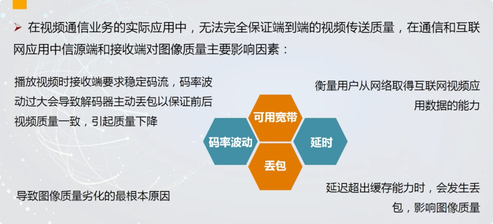
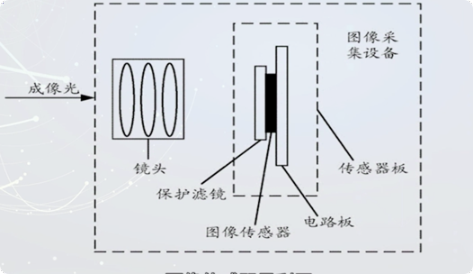

# 视频编码概述
## 视频图像的基本概念（一）
- 什么是图像？
> 图片
- 图像的分类？
> 模拟图像f（x，y）和数字图像f（m，n）
>
> 实际图像(如照片)、抽象图像（函数f（x，y）、f（m，n））
>
> 二值图像：像素点为0 or 1
> 
> 灰度图像
>
> 彩色图像：**每个像素有不同的颜色**

## 视频图像的基本概念（二）
- **图像的表示方法**

1.模拟图像的表示
>  
>
>  
>
>  

2.数字图像的表示
> 
>
> 
>
> 
>

## 视频图像的基本概念（三）
> 
>
> 
>
> 
>
> **每个像素由RGB三个分量构成**

## 图像的颜色模型
### 颜色的基础知识

### 颜色的模型

#### RGB颜色模型

#### CYM颜色模型（减色系统）

#### HSI（HSV）颜色模型


#### YUV（YCbCr）颜色模型


## 视频图像的质量评价(一)
### 人眼的视觉特性


### 图像的质量测度

### 图像的评价方法


### 图像评价方法的优劣

## 视频图像的质量评价(二)
### 摄像机视频质量测试内容
> -  分辨率
>> 标清 4:3( 720*480i、720*576i) 16：9（960*480i、960*576i） 
>
>> 增强清晰度 4:3( 720*480p、720*576p) 16：9（960*480p、960*576p）
>
>> 高清(具有720逐行[720p]或1080隔行[1090i]有效扫描线的视频)  16：9（1280*720p或1280*1080i） 
>
> 
> - 色彩还原度
>
> - 灰阶度
>
> - 频宽测试
>
> - CCD平整度
>
> - 阻抗匹配
>
> - 人脸识别
>
>- 模糊、漏光、干扰、暗角、阴影、拖尾、噪点、失真、低照度、强光抑制、色滚、宽动态、白平衡、图像层次、亮点

### 视频传输质量评估


 


## 视频图像的质量评价(三)
### 图片压缩分类
**无损压缩**和**有损压缩**

# 视频编码的必要性
- 数据与信息的区别
> 数据用来记录和传送信息，是信息的载体；数据的处理结果是信息。
>
> 数据压缩的对象是数据，而不是信息。
>
> 数据压缩的目的是在传送过程和处理信息时，尽量减少数据量
>
> **数据量 = 信息量 + 冗余数据来量**

- 冗余的分类
> i. **空间冗余**
> 
>>
>>
>> 传输某一个值和它的差值，不用整个传输

> ii. **时间冗余**
> 
> 视频相邻帧之间存在时间冗余。
>>

> iii. **心理视觉冗余**
>
>>
>
> 人类视觉系统不是对所有的视觉信息都具有相同的敏感度。
>
> ➢1.对**亮度**信息敏感,对**色度**信息相对不敏感;
>
> ➢2.自然界的光强的动态范围0~ 2^9，人眼能分辨的图像**灰度等级为2^6** ,因此通常对模拟信号量化为8bit或者l6bit
>
> ➢3.对图像变换后的低频信号较敏感,高频不敏感,因此,可以**去除部分高频信息**;
>
> ➢4.对静止或者运动平缓的视频信息具有较高的分辨力，对于快速运动的物体分辨能力大大下降

> iv. **编码冗余**
>
>> 对图像的所有信息使用相同长度的符号表示,比特数较多;
>>
>> 按照**像素信息熵**(_单位比特/像素,熵越大，图像越清晰。反映了图像中平均信息量的多少，表示图像灰度分布的聚集特征_)的大小为其分配相应的比特数，最优;
>>
>> 在进行图像采样和量化时一般的方法是对所
有的像素分配相同的比特数，此时平均比特
数不能达到或者接近熵值,存在编码冗余;
>
>
>
> 去除编码冗余：变长编码，概率较大的使用较短编码，概率小的使用长编码。
>

# 视频编码的发展
## 国际标准组织
( 1 )**国际电信联盟**( **ITU** , International Telecommunication Union)
中ITU的历史可以追溯到1865年。为了顺利实现国际电报通信, 1865年5月17日，法、德、俄
意、奥等20个欧洲国家的代表在巴黎签订了《国际电报公约》，国际电报联盟
( International Telegraph Union , ITU )也宣告成立。
随着电话与无线电的应用与发展, ITU的职权不断扩大。1906年，德、英、法、美、日等
27个国家的代表在柏林签订了《国际无线电报公约》。

( 2 ) **国际无线电咨询委员会** (**CCIR**,Consultative Committee of International Radio)

( 3 )**国际电报电话咨询委员会**(**CCITT**,International consultative committee on telecommunications and Telegraphy)

## 视频编码的发展历程

## 视频编码的特点

### JPEG.M-JPEG 
有相当一部分国内外网络摄像机和视频服务
器都是采用**JPEG** , **Motion-JPEG** 压缩技术,
JPEG、M-JPEG采用的是**帧内压缩**方式,图
像清晰、稳定，适于视频编辑，而且可以灵
活设置每路的视频清晰度和压缩帧数。
---
### H.263
H.263是一个较为成熟的标准,它是**帧间
预测和变换编码**的混合算法,压缩比较
高，尤其适用低带宽上传输活动视频。
---
采用H.263技术生产的网络型产品,其成
本较为适中,软/硬件丰富,适合集中监
控数量较多的需求。
---
### MPEG-4
MPEG-4的着眼点在于解决低带宽上音视频的传输问题,在164KHZ的带宽上,
MPEG-4平均可传5 - 7帧秒。采用MPEG-4压缩技术的网络型产品可使用带宽
较低的网络,如PSTN , ISDN,ADSL等,大大节省了网络费用。
---
MPEG-4的最高分辨率可达720x576 ,接近DVD画面效果,基于图像压缩的模
式决定了它对运动物体可以保证有良好的清晰度。MPEG-4所有 的这些优点,
使它成为当前网络产品生产厂商开发的重要趋势之一。
---
### AVS
AVS ( Audio Video coding Standard ,音视
频编码标准)是《信息技术先进音视频编
码》系列标准的简称,是我国具备自主知
识产权的第二代信源编码标准，也是数字
音视频产业的共性基础标准。

# 视频压缩技术的分类
## 无损压缩(多采用概率统计编码)、有损压缩
## 软硬件压缩

## 模拟信号、数字信号

## 压缩算法分类
### 帧内压缩(减少空间冗余)
压缩一帧图像时,**仅考虑本帧的数据**而不考虑相邻帧之间的冗余信息

一般采用**有损压缩**算法

压缩后的视频数据仍然可以以帧为单位进行编辑

压缩比较低
### 帧间压缩（减少时间冗余）
一般是采用无损压缩算法，用**帧差值算法**,通过比较本帧与相邻帧之间的差异,仅记录本帧与其**相邻帧的差值**,大大减少数据量

# 视频图像通信系统的基本构成
## 模拟图像通信系统的构成


- **图像信息源**:是进行光电变换后得到图像信息,完成光电变换的设备也称为图像通
信系统的输入设备。



 
## 数字图像通信系统的构成


**信源编码包括三个过程，`抽样、量化和编码`**


# 熵及熵编码的基本原理
## 信息量的概念
表示该符号所需要的位数


## 熵编码的概念
Shannon第一定律(率失真定律)确定了在编码过程中不损失任何信息,即在无损编码条件下数据压缩的理论极限是信息的熵,并指出了如何建立最优数据压缩编码方法。


## 平均码长定义


## 无失真编码定理
 平均码长Lavg >> H(X):有冗余，不是最佳;
 
 平均码长Lave < H(X): 不可能

 平均码长Lavg ≈ H(X): 是最佳编码
 
 **编码的基本思想就是用较少的比特数表示出现概率较大的码源符号,用较多的比特数
表示出现概率小的码源符号;** eg：_霍夫曼编码_
## 编码效率的定义


# 霍夫曼编码（一）
## 霍夫曼算法简介
Huffman编码是1952年为压缩文本文件所设计的编码方法，也是目前消除视频信息冗余最常使用的方法之一;

对出现**概率最大**的符号赋以**最短的码字**，**概率越小表示的码字越长**，从而使表示每个符号的平均比特数最小。
## 霍夫曼编码步骤（赋值与反推）
 
## 霍夫曼编码特点
```
霍夫曼编码是瞬时惟一的可解块编码;

瞬时:符号串中每个码字无需参考后继符号就可解码;

惟一可解码:任何符号串只能以一种方式解码; 

块编码:每个信源符号都映射到一个编码符号的固定序列中;
```


```
➢霍夫曼编码是惟一可译码。短的码不会成为更长码的起始部分;

➢霍夫曼编码的平均码长接近于熵;

➢与计算机的数据结构不匹配;

➢需要多次排序，耗费时间。
```
**霍夫曼编码的算法是确定的，但编出的码并非是 唯一的。**

**由于霍夫曼编码的依据是信源
符号的概率分布，故其编码效
率取决于信源的统计特性。**

```
➢霍夫曼编码的局限性在于，该编码方法只适用于离散信
源，即信源符号个数为有限数;
➢编码时需要知道输入符号集的概率分布;
➢在进行Huffman编码压缩时，计算量大而复杂，尤其是
译码复杂度较高。
➢由于码长不等，还存在一个输入与输出的速率匹配问题。
```

## 霍夫曼编码举例
 
 
 
 
 
 
 
 
 
 
 
  

# 霍夫曼编码（二）
## 霍夫曼编码的树结构分析法


# 霍夫曼编码（三）
## 霍夫曼编码的图像分析法


## 霍夫曼编码的局限性


## 霍夫曼编码算法解码


# 算数编码（一）
## 算数编码原理
  ```
 算术编码是1980年代发展起来的一种熵编码方法。

 基本原理是将被编码的数据序列表示成0和1之间的一
个间隔(也就是一个小数范围) ,该间隔的位置与输入
数据的概率分布有关。信息越长,编码表示的间隔就
越小，因而表示这一间隔所需的=进制位数就越多
(由于间隔是用小数表示的)。
```
## 算数编码步骤
```算数编码是从整个符号序列出发,采用递推式连续编码的方法。```

`解码时,根据该区间判断信源各个符号出现的顺序和类型。`

设信源符号表是{a1，a2 , a3 , a4} ,其符号出现的概率分别为{0.2
0.1 , 0.4 , 0.3} ,请按照序列{a2 , al , a4 , a3}进行算术编码。


那么，任何一个该区间中的实数,如, 0.2160就可用来表示序列{a2a1a4a3}的编码
## 算数解码步骤
`解码过程是对按照当前的编码进行识别的过程。`

`当得到一个图像的编码后,根据其各个信源符号
的概率进行分析,找到当前编码所符合的概率空
间,逐步求精,即可得到原始符号序列信息。`


 
# 算数编码（二）
## 算数编码分析
`算术编码是一种从整个符号系列出发,采用递推形式连续编
码的方法。在算术编码中,字母表中的符号和码字间不再存
在对应关系,一个算术码字要赋给整个信源符号序列
(即不是一次编一个号) ,而码字本身确定0和1之间的一
个实数区间。`

`不论是否是二元信源,也不论数据的概率分布如何,其平均
码长均能逼近信源的熵。`

`算术编码和霍夫曼编码的区别就在于:在算术编码中
输入序列(即被赋给单个码字的符号块)的长度,是
可变的，可以说,算术编码是将可变长码字赋给可变
长符号块。`

`正是由于算术编码不需要为定长符号块分配整数长的
码字,理论上能达到无损编码定理所规定的最低限。`

`在编码过程中,尽管在计算时有乘法运算,但可以通
过移位实现，即通过加法和移位实现算术运算。在解
码时，要除以符号区间概率,也可以通过移位实现
即通过减法和移位实现算术解码。这正是把这种编码
方法称为算术码的原因。`

`算术编码从全序列出发,采用递推形式的连续编码，
它不是将单个的信源符号映射成一个码字,而是将整
个符号序列映射为实数轴上[0,1 )区间内的一一个小区
间，其长度等于该序列的概率。`

`随着输入符号越来越多,子区间分割越来越精细,因
此表示其左端点的数值的有效位数也越来越多。`

`如果等整个符号序列输入完毕后再将最终得到的左端点
输出,将遇到两个问题:第一,当符号序列很长时,将
不能实时编解码;第二,有效位太长的数难以表示。`

`为了解决这个问题,通常采用两个有限精度的移位寄存:
器存放码字的最新部分,随着序列中符号的不断输入,
不断地将其中的高位移出到信道上,以实现实时编解码。`


## 算数编码效率
算术编码的最大优点之- 在于它具有自适应性和高编码效率。

算术编码的模式选择直接影响编码效率。其模式有固定模式和自适
应模式两种。

固定模式是基于概率分布模型的,而在自适应模式中,其各符号的
初始概率都相同，但随着符号顺序的出现而改变,在无法进行信源
概率模型统计的条件下,非常适于使用自适应模式的算术编码。
 
在误差扩散方面,也比分组码更严重。在分组码中，由于误
码而破坏分组,过一-段时间后常能自动恢复;但在算术码中
却往往会-直延续下去，因为它是从全序列出发来编码的。

因而算术码流的传输也要求高质量的信道,或采用检错反馈
重发的方式。
 


## 游程编码
