# 自动内存管理

## Java内存区域与内存溢出异常

### 运行时数据区


JDK 1.8


Java虚拟机在执行Java程序的过程中会把它所管理的内存划分为若干个不同的数据区域。这些区域
有各自的用途，以及创建和销毁的时间，有的区域随着虚拟机进程的启动而一直存在，有些区域则是
依赖用户线程的启动和结束而建立和销毁。

- 哪些区域一直存在？

- 哪些区域依赖线程的启动和结束创建和销毁？

#### 1. 程序计数器
`程序计数器（Program Counter Register）`是一块较小的内存空间，它可以看作是当前线程所执行的`字节码的行号指示器`。

字节码解释器工作时就是`通过改变这个计数器的值来选取下一条需要执行的字节码指令`，程序控制流的`指示器`，`分支`、`循环`、`跳转`、`异常处理`、`线程恢复`等基础功能都需要依赖`程序计数器`来完成。

由于Java虚拟机的多线程是通过`线程轮流切换`、分配处理器执行时间的方式来实现的，`在任何一个确定的时刻，一个处理器（对于多核处理器来说是一个内核）都只会执行一条线程中的指令`。因此，为了线程切换后能恢复到正确的执行位置，每条线程都需要有一个独立的程序计数器，各条线程之间计数器互不影响，独立存储，我们称这类内存区域为`“线程私有”`的内存。

- `程序计数器记住的什么？`
>如果线程执行的是：**java方法**，这个计数器记录的是`正在执行的虚拟机字节码指令的地址`；**本地（Native）方法**，这个计数器值则应为`空`（`Undefined`）。

`程序计数器内存区域`是唯一一个在《Java虚拟机规范》中没有规定任何`OutOfMemoryError`情况的区域。
#### 2. Java`虚拟机栈`
- 与程序计数器一样，Java虚拟机栈（Java Virtual Machine Stack）也是`线程私有`的，它的`生命周期与线程相同`。

- `虚拟机栈`描述的是`Java方法`执行的`线程内存模型`：每个方法被执行的时候，Java虚拟机都会同步创建一个`栈帧`（Stack Frame）用于存储`局部变量表`、`操作数栈`、`动态连接`、`方法出口`等信息。每一个方法被调用直至执行完毕的过程，就对应着一个栈帧在虚拟机栈中从入栈到出栈的过程。


**局部变量表**：存放了`编译期可知`的各种Java虚拟机`基本数据类型`（*boolean、byte、char、short、int、float、long、double*）、`对象引用`类型、`returnAddress类型`，现在已经由`异常表`代替。这些数据类型在局部变量表中的存储空间以`局部变量槽（Slot）`来表示，其中64位长度的`long`和`double`类型的数据会占用`两个`变量槽，其余的数据类型`只占用一个`。`局部变量表所需的内存空间在编译期间完成分配`，当进入一个方法时，这个方法需要在栈帧中分配多大(*指变量槽的数量*)的局部变量空间是完全确定的，在方法运行期间不会改变局部变量表的大小。

**操作数栈**：主要用于保存计算过程中的中间结果,同时作为计算过程中变量临时的存储空间。Java虚拟机的解释执行引擎称为“基于栈的执行引擎”，其中所指的“栈”就是操作数栈。如果当前线程请求的栈深度大于虚拟机所允许的最大深度，将抛出`StackOverflowError`异常。

**动态连接**：每个栈帧都包含一个`指向运行时常量池中该栈帧所属方法的引用`，持有这个引用是为了支持方法调用过程中的动态连接(Dynamic Linking)。Class文件的常量池中存有大量的符号引用，字节码中的方法调用指令就以常量池中指向方法的符号引用作为参数。这些符号引用一部分会在类加载阶段或者第一次使用的时候就转化为直接引用，这种转化称为静态解析。另外一部分将在每一次运行期间转化为直接引用，这部分称为动态连接。

Java代码在进行Javac编译的时候，并不像C和C++那样有“连接”这一步骤，而是在虚拟机加载Class文件的时候进行动态连接。也就是说，在Class文件中不会保存各个方法、字段的最终内存布局信息，因此这些字段、方法的符号引用不经过运行期转换的话无法得到真正的内存人口地址，也就无法直接被虚拟机使用。当虚拟机运行时，需要从常量池获得对应的符号引用，再在类创建时或运行时解析、翻译到具体的内存地址之中。

**方法出口**:返回地址。

[栈帧详解](https://blog.csdn.net/u012988901/article/details/100043857)

[彻底弄懂java中的常量池](https://cloud.tencent.com/developer/article/1450501)

---
**内存区域规定了两类异常状况**：如果线程请求的栈深度大于虚
拟机所允许的深度，将抛出`StackOverflowError`异常；如果Java虚机栈容量可以动态扩展，当栈扩展时`无法申请到足够的内存`会抛出`OutOfMemoryError`异常。

---

#### 3. 本地方法栈
- 本地方法栈则是为虚拟机使用到的本地（Native）
方法服务。

- 本地方法栈也会在栈深度溢出或者栈扩展失败时分别抛出StackOverflowError和OutOfMemoryError异常。

#### 4.Java堆
- 从分配内存的角度看，所有线程共享的Java堆中可以划分出多个线程私有的**分配缓冲区**（*Thread Local Allocation Buffer，TLAB*），以提升对象分配时的效率。不过无论从什么角度，无论如何划分，都不会改变Java堆中存储内容的共性，**无论是哪个区域，存储的都只能是对象的实例**，`将Java堆细分的目的只是为了更好地回收内存，或者更快地分配内存`。

- 如果在Java堆中没有内存完成实例分配，并且堆也无法再
扩展时，Java虚拟机将会抛出OutOfMemoryError异常。

#### 5. 方法区
- 方法区的作用？
每个线程都共享的内存区域，用于存储已被虚拟机加载的*类型信息*、*常量*、*静态变量*、*即时编译后的代码缓存*

- [元空间](https://juejin.cn/post/6844904020964802574) & [本地内存](https://www.jianshu.com/p/60afb21c8876)

- 方法区的垃圾收集主要是什么？
`常量池的回收`和对`类型的卸载`

##### 运行时常量池
**运行时常量池**（*Runtime Constant Pool*）是方法区的一部分。Class文件中除了有*类的版本*、*字段*、*方法*、*接口*等描述信息外，还有一项信息是*常量池表*（Constant Pool Table），*用于存放编译期生成的各种字面量与符号引用*，**这部分内容将在类加载后存放到方法区的`运行时常量池`中**。

运行时常量池是方法区的一部分，自然受到方法区内存的限制，当常量池无法再申请到内存时会抛出`OutOfMemoryError`异常。

##### 直接内存
> 在JDK 1.4中新加入了`NIO`（New Input/Output）类，引入了一种基于`（Channel）与缓冲区（Buffer）`的I/O方式，它可以`使用Native函数库直接分配堆外内存`，然后通过一个存储在Java堆里面的`DirectByteBuffer`对象作为这块内存的引用进行操作。这样能在一些场景中显著提高性能，因为避免了在Java堆和Native堆中来回复制数据。
------ 
### HotSpot虚拟机在Java堆中对象分配、布局和访问的全过程
### 对象分配
- 普通对象（特殊对象：数组、Class对象）的创建过程？

当Java虚拟机遇到一条字节码new指令时，首先将去检查这个指令的参数是否能在常量池中定位到一个类的符号引用，并且检查这个符号引用代表的类是否已被加载、解析和初始化过。如果没有，那必须先执行相应的类加载过程。在类加载检查通过后，接下来虚拟机将为新生对象分配内存。内存分配完成之后，虚拟机必须将分配到的内存空间（但不包括对象头）都初始化为零值。接下来，Java虚拟机还要对对象进行必要的设置，例如*这个对象是哪个类的实例*、*如何才能找到类的元数据信息*、*对象的哈希码*（实际上对象的哈希码会延后到真正调用Object::hashCode()方法时才计算）、*对象的GC分代年龄*等信息。这些信息存放在对象的**对象头**（*Object Header*）之中。

- 什么是指针碰撞 & 空闲列表？

为对象分配空间的任务实际上便等同于把一块确定
大小的内存块从Java堆中划分出来。假设Java堆中内存是绝对规整的，所有被使用过的内存都被放在一边，空闲的内存被放在另一边，中间放着一个指针作为分界点的指示器，那所分配内存就仅仅是把那个指针向空闲空间方向挪动一段与对象大小相等的距离，这种分配方式称为`“指针碰撞”（Bump The Pointer）`。但如果Java堆中的内存并不是规整的，已被使用的内存和空闲的内存相互交错在一起，那就没有办法简单地进行指针碰撞了，虚拟机就必须维护一个列表，记录上哪些内存块是可用的，在分配的时候从列表中找到一块足够大的空间划分给对象实例，并更新列表上的记录，这种分配方式称为`“空闲列表”（Free List）`。

- 指针碰撞 & 空闲列表 的收集器？

选择哪种分配方式由Java堆是否规整决定，而Java堆是否规整又由所采用
的垃圾收集器是否带有`空间压缩整理（Compact）`的能力决定。因此，当使用`Serial`、`ParNew`等带`压缩整理`过程的收集器时，系统采用的分配算法是`指针碰撞`，既简单又高效；而当使用`CMS这种基于清除（Sweep）算法`的收集器时，理论上就只能采用较为复杂的`空闲列表`来分配内存。

- 指针碰撞如何在并发下保证内存分配的安全性呢？

**问题**：对象创建在虚拟机中是非常频繁的行为，即使仅仅修改一个指针所指向的位置，在并发情况下也并不是线程安全的，可能出现正在给对象A分配内存，指针还没来得及修改，对象B又同时使用了原来的指针来分配内存的情况。

**解决方案：**

i.对分配内存空间的动作进行同步处理——实际上虚拟机是采用CAS配上失败
重试的方式保证更新操作的原子性；

ii. 把内存分配的动作按照线程划分在不同的空间之中进行，即每个线程在Java堆中预先分配一小块内存，称为`本地线程分配缓冲`（*Thread Local Allocation Buffer，TLAB*），哪个线程要分配内存，就在哪个线程的本地缓冲区中分配，只有本地缓冲区用完了，分配新的缓存区时才需要同步锁定。

## 对象布局
在HotSpot虚拟机里，对象在堆内存中的存储布局可以划分为三个部分：`对象头（Header）`、`实例数据（Instance Data）`和`对齐填充（Padding）`。

**对象头**

对象头包含两部分，一部分是用于存储对象自身的运行时数据，如哈希码（HashCode）、GC分代年龄、锁状态标志、线程持有的锁、偏向线程ID、偏向时间戳等，这部分数据的长度在32位和64位的虚拟机（未开启压缩指针）中分别为32个比特和64个比特，官方称它为`“Mark Word”`。另一部分是`类型指针`，即对象指向它的类型元数据的指针，`Java虚拟机通过这个指针来确定该对象是哪个类的实例`。

- 查找对象的元数据信息并不一定要经过对象本身,还可以通过什么？

*此外，如果对象是一个Java数组，那在对象头中还必须有一块用于记录数组长度的数据，因为虚拟机可以通过普通Java对象的元数据信息确定Java对象的大小，但是如果数组的长度是不确定的，将无法通过元数据中的
信息推断出数组的大小。*

**实例数据**

实例数据部分是对象真正存储的有效信息，即我们在`程序代码里面所定义的各种类型的字段内容`，无论是从父类继承下来的，还是在子类中定义的字段都必须记录起来。这部分的存储顺序会`受到虚拟机分配策略参数`（-XX：FieldsAllocationStyle参数）和`字段在Java源码中定义顺序的影响`。

*相同宽度的字段总是被分配到一起存放，在满足这个前提条件的情况下，在父类中定义的变量会出现在子类之前。*

**对齐填充**

仅仅起着占位符的作用。由于HotSpot虚拟机的自动内存管理系统要求对象起始地址必须是8字节的整数倍，换句话说就是任何对象的大小都必须是8字节的整数倍。对象头部分已经被精心设计成正好是8字节的倍数（1倍或者
2倍），因此，如果对象实例数据部分没有对齐的话，就需要通过对齐填充来补全。

## 对象访问

`通过栈上的reference数据来操作堆上的具体对象。`

- 主流的访问方式主要有使用`句柄`和`直接指针`两种：

> 如果使用句柄访问的话，Java堆中将可能会划分出一块内存来作为句柄池，reference中存储的就是对象的句柄地址，而句柄中包含了对象实例数据与类型数据各自具体的地址信息
>> 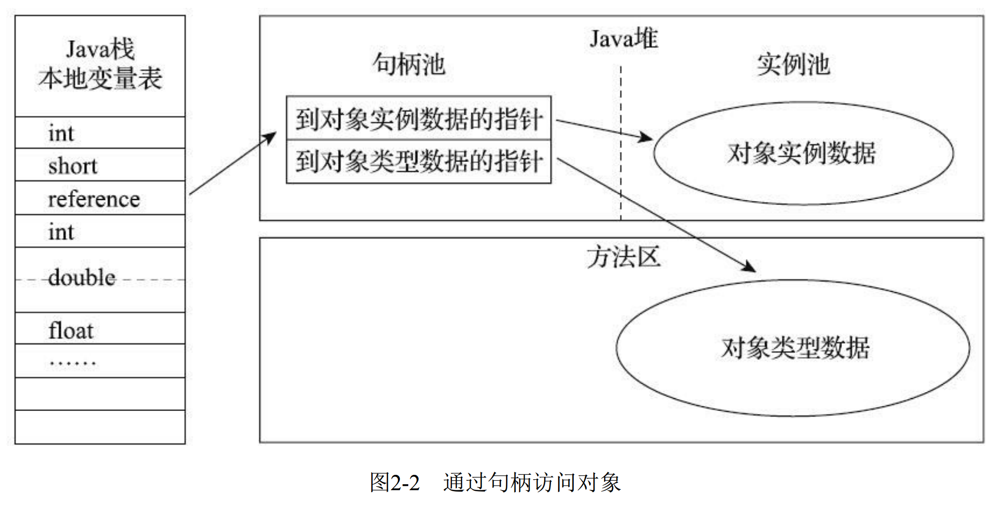

> 直接指针来访问最大的好处就是速度更快，它节省了一次指针定位的时间开销.*HotSpot虚拟机使用这种方式。*
>> 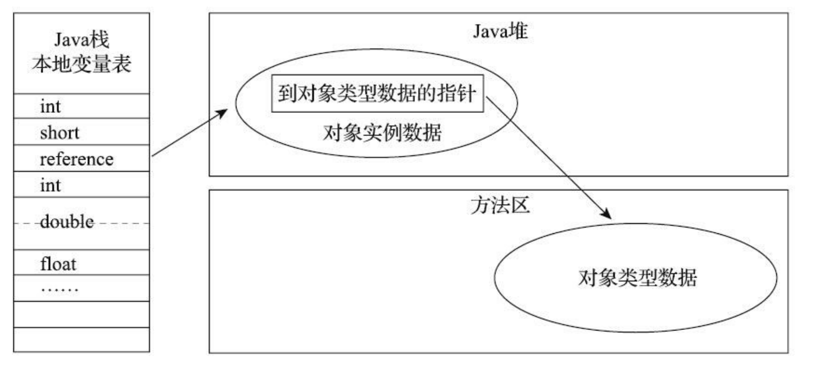


# JVM OutOfmemory实战
**堆溢出**

```java
import java.util.ArrayList;
import java.util.List;

/**
 * VM Args：-Xms20m -Xmx20m -XX:+HeapDumpOnOutOfMemoryError
 *
 * @author zzm
 */
public class HeapOOM {
    static class OOMObject {
    }

    public static void main(String[] args) {
        List<OOMObject> list = new ArrayList<OOMObject>();
        while (true) {
            list.add(new OOMObject());
        }
    }
}
```
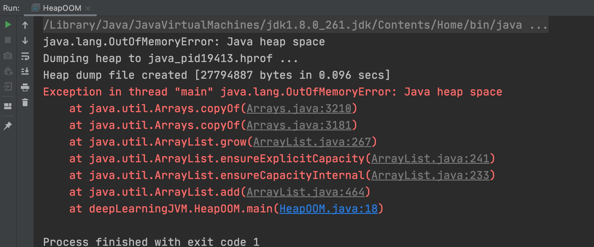

堆溢出问题分析：分为`内存泄漏（*Memory Leak*）`还是`内存溢出`*（MemoryOverflow）*。

- 内存泄漏

可进一步通过工具查看泄漏对象到GC Roots的引用链，找到泄漏对象是通过怎样的引用路径、与哪些GC Roots相关联，才导致垃圾收集器无法回收它们，根据泄漏对象的类型信息以及它到GC Roots引用链的信息，一般可以比较准确地定位到这些对象创建的位置，进而找出产生内存泄漏的代码的具体位置。

- 内存溢出

就应当检查Java虚拟机的堆参数（-Xmx与-Xms）设置，与机器的内存对比，看看是否还有向上调整的空间。

再从代码上检查是否存在某些对象生命周期过长、持有状态时间过长、存储结构设计不合理等情况，尽量减少程序运行期的内存消耗。

**虚拟机栈和本地方法栈溢出**

HotSpot虚拟机中并不区分虚拟机栈和本地方法栈,栈容量可以由-Xss参数来设定。虚拟机栈和本地方法栈，在《Java虚拟机规范》中描述了两种异常：

- 1）如果线程请求的`栈深度`大于`虚拟机所允许的最大深度`，将抛出`StackOverflowError`异常。

- 2）如果虚拟机的`栈内存允许动态扩展`，当扩展栈容量无法申请到足够的内存时，将抛OutOfMemoryError异常。*而HotSpot虚拟机的选择是不支持扩展，所以除非在创建线程申请内存时就因无法获得足够内存而出现OutOfMemoryError异常，否则在线程运行时是不会因为扩展而导致内存溢出.*

```java
package deepLearningJVM;

public class JavaVMStackSOF {
    private int stackLength = 1;

    public void stackLeak() {
        stackLength++;
        // 递归调用
        stackLeak();
    }

    public static void main(String[] args) throws Throwable {
        JavaVMStackSOF oom = new JavaVMStackSOF();
        try {
            oom.stackLeak();
        } catch (Throwable e) {
            System.out.println("stack length:" + oom.stackLength);
            throw e;
        }
    }
}
```
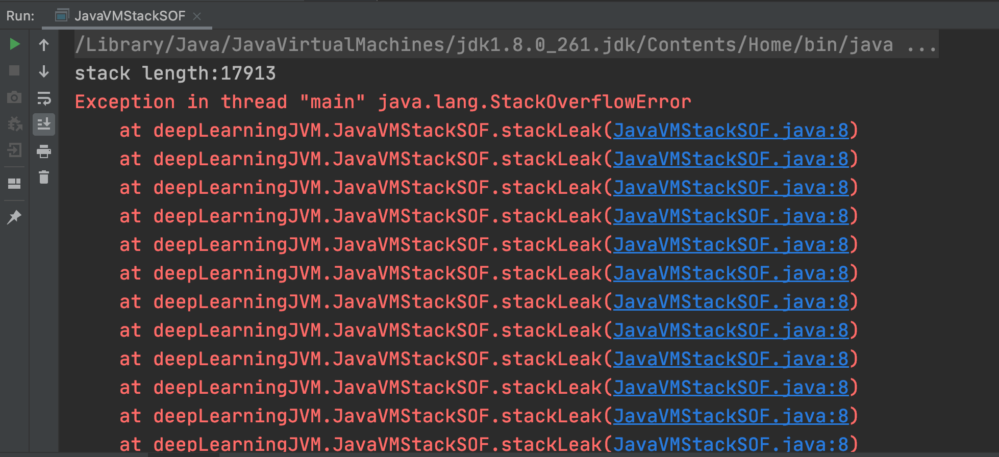

**方法区和运行时常量池溢出**
方法区溢出：动态代理生成很多个代理类
常量池溢出：String.inter(),jdk1.6和jdk1.7的区别？

**本机直接内存溢出**

使用DirectByteBuffer分配内存也会抛出内存溢
出异常，但它抛出异常时并没有真正向操作系统申请分配内存，而是通过计算得知内存无法分配就会在代码里手动抛出溢出异常，真正申请分配内存的方法是`Unsafe::allocateMemory()`。

## 垃圾收集器与内存分配策略
GC需要完成的三件事
- 哪些内存需要回收？

`程序计数器、虚拟机栈、本地方法栈`3个区域随线程而生，随线程而灭,每一个栈帧中分配多少内存基本上是在类结构确定下来时就已知的，因此这几个区域的内存分配和回收都具备确定性，在这几个区域内就不需要过多考虑如何回收的问题，`当方法结束或者线程结束时，内存自然就跟随着回收了。`

`Java堆和方法区`这两个区域则有着很显著的不确定性：一个接口的多个实现类需要的内存可能会不一样，一个方法所执行的不同条件分支所需要的内存也可能不一样，只有处于运行期间，我们才能知道程序究竟会创建哪些对象，创建多少个对象，这部分内存的分配和回收是动态的。`垃圾收集器所关注的正是这部分内存该如何管理。`
- 什么时候回收？

[引用计数算法]()

在对象中添加一个引用计数器，每当有一个地方引用它时，计数器值就加一；当引用失效时，计数器值就减一；任何时刻计数器为零的对象就是不可能再被使用的。

主流的Java虚拟机里面都没有选用引用计数算法来管理内存，主要原因是，这个看似简单的算法有很多例外情况要考虑，必须要配合大量额外处理才能保证正确地工作，譬如单纯的引用计数就很难解决对象之间相互循环引用的问题。

**循环引用问题**
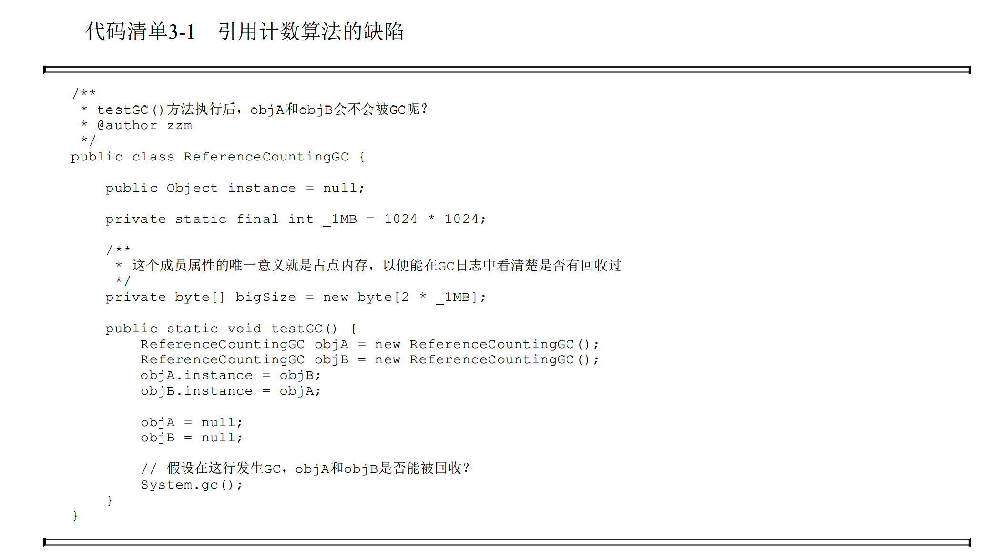

[可达性分析算法]()

通过一系列称为`“GC Roots”`的根对象作为起始节点集，从这些节点开始，根据引用关系向下搜索，搜索过程所走过的路径称为`“引用链”`（*Reference Chain*），如果某个对象到GC Roots间没有任何引用链相连，或者用图论的话来说就是从GC Roots到这个对象不可达时，则证明此对象是不可能再被使用的。

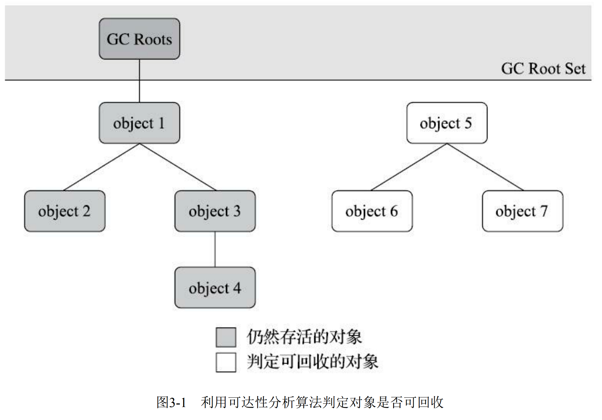

[可作为GC Roots的对象]()
- 在虚拟机`栈（栈帧中的本地变量表）中引用的对象`，譬如各个线程被调用的方法堆栈中使用到的参数、局部变量、临时变量等。
- 在方法区中`类静态属性引用的对象`，譬如Java类的引用类型静态变量。
- 在方法区中`常量引用的对象`，譬如字符串常量池（String Table）里的引用。
- 在`本地方法栈`中`JNI（即通常所说的Native方法）引用的对象`。
- `Java虚拟机内部的引用`，如`基本数据类型对应的Class对象`，一些`常驻的异常对象`（比如*NullPointExcepiton、OutOfMemoryError*）等，还有`系统类加载器`。
- `所有被同步锁（synchronized关键字）持有的对象。`
- `反映Java虚拟机内部情况的JMXBean、JVMTI中注册的回调、本地代码缓存等`。

[几种引用]()

在JDK 1.2版之后，Java对引用的概念进行了扩充，将引用分为`强引用`（*Strongly Re-ference*）、`软引用`（*Soft Reference*）、`弱引用`（*Weak Reference*）和`虚引用`（*Phantom Reference*）4种，这4种引用强度依次逐渐减弱。

> 强引用是最传统的“引用”的定义，是指在程序代码之中普遍存在的引用赋值，即`类似“Object obj=new Object()”这种引用关系。`无论任何情况下，只要强引用关系还存在，垃圾收集器就永远不会回收掉被引用的对象。

> `软引用是用来描述一些还有用，但非必须的对象`。只`被软引用关联着的对象，在系统将要发生内存溢出异常前，会把这些对象列进回收范围之中进行第二次回收，如果这次回收还没有足够的内存，才会抛出内存溢出异常。`在JDK 1.2版之后提供了SoftReference类来实现软引用。

> `弱引用也是用来描述那些非必须对象`，但是它的强度比软引用更弱一些，被弱引用关联的对象只能生存到下一次垃圾收集发生为止。当垃圾收集器开始工作，`无论当前内存是否足够，都会回收掉只被弱引用关联的对象。`在JDK 1.2版之后提供了WeakReference类来实现弱引用。

> 虚引用也称为“幽灵引用”或者“幻影引用”，它是最弱的一种引用关系。`一个对象是否有虚引用的存在，完全不会对其生存时间构成影响，也无法通过虚引用来取得一个对象实例。为一个对象设置虚引用关联的唯一目的只是为了能在这个对象被收集器回收时收到一个系统通知。`

[如何判断对象生存还是死亡？]()
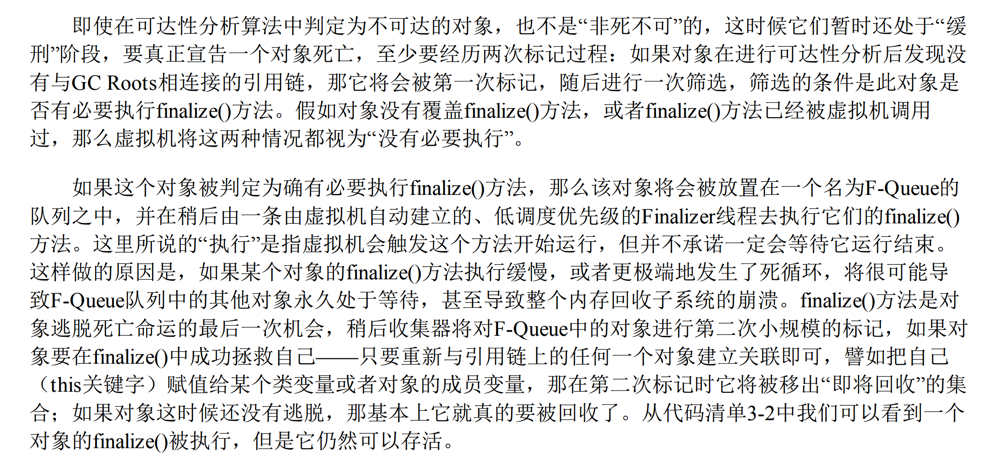

[回收方法区]()
方法区的垃圾收集主要回收两部分内容：`废弃的常量和不再使用的类型。`

判定一个类型是否属于“不再被使用的类”的条件就
比较苛刻了。需要同时满足下面三个条件：

·该类所有的实例都已经被回收，也就是Java堆中不存在该类及其任何派生子类的实例。

·加载该类的类加载器已经被回收，这个条件除非是经过精心设计的可替换类加载器的场景，如OSGi、JSP的重加载等，否则通常是很难达成的。

·该类对应的java.lang.Class对象没有在任何地方被引用，无法在任何地方通过反射访问该类的方
法。

- 如何回收？


## [（追踪式）垃圾回收算法]()

名词定义
- `部分收集（Partial GC`）：指目标不是完整收集整个`Java堆`的垃圾收集

■ `新生代收集`（*Minor GC/Young GC*）：指目标只是新生代的垃圾收集。

■ `老年代收集`（*Major GC/Old GC*）：指目标只是老年代的垃圾收集。目前只有*CMS*收集器会有单独收集老年代的行为。

■ `混合收集`（*Mixed GC*）：指目标是收集整个新生代以及部分老年代的垃圾收集。目前只有G1收
集器会有这种行为。

- `整堆收集`（*Full GC*）：收集整个Java堆和方法区的垃圾收集。

## [标记-清除（Mark-Sweep）算法]()
首先标记出所有需要回收的对象，在标记完成后，统一回收掉所有被标记的对象，也可以反过来，标记存活的对象，统一回收所有未被标记的对象。


主要缺点有两个：第一个是`执行效率不稳定`，如果Java堆中包含大量对
象，而且其中大部分是需要被回收的，这时`必须进行大量标记和清除的动作`，导致标记和清除两个过程的`执行效率`都随对象数量增长而降`低`；

第二个是`内存空间的碎片化问题`，`标记、清除之后会产生大量不连续的内存碎片`，空间碎片太多可能会导致当以后在程序运行过程中需要分配较大对象时无法找到足够的连续内存而不得不提前触发另一次垃圾收集动作。

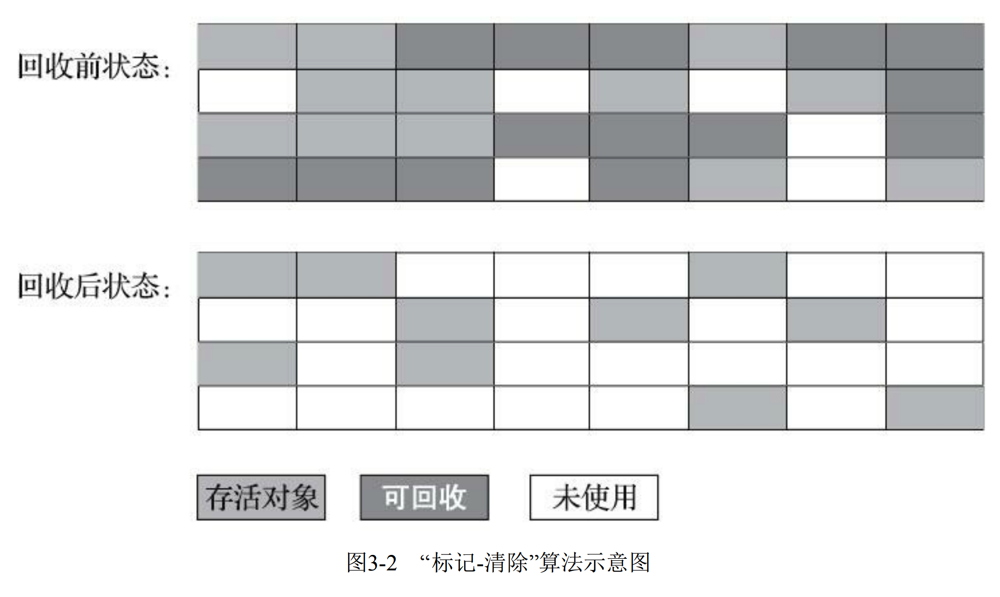

## [标记-复制算法]()
`“半区复制”`（*Semispace Copying*）的垃圾收集算法，它将可用
内存按容量划分为大小相等的两块，每次只使用其中的一块。当这一块的内存用完了，就将还存活着的对象复制到另外一块上面，然后再把已使用过的内存空间一次清理掉。如果内存中多数对象都是存活的，这种算法将会产生大量的内存间复制的开销。

其缺陷也显而易见，这种复制回收算法的代价是将可用内存缩小为了原来的一半，空间浪费未免太多了一点。

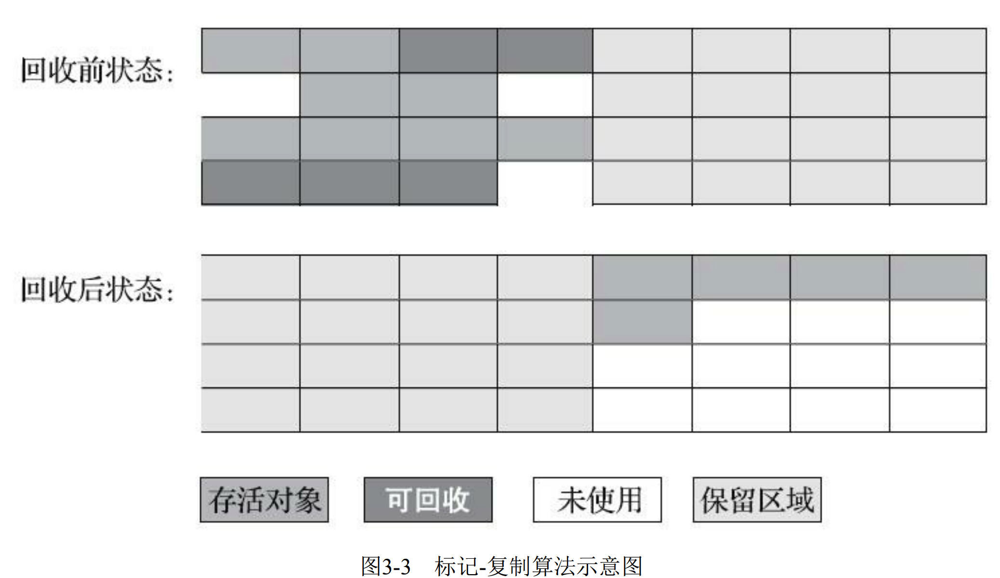

HotSpot虚拟机的Serial、ParNew等新生代收集器均采用了这种策略来设
计新生代的内存布局。

具体做法是`把新生代分为一块较大的Eden空间和两块较小的Survivor空间`，每次分配内存只使用Eden和其中一块Survivor。发生垃圾搜集时，将Eden和Survivor中仍然存活的对象一次性复制到另外一块Survivor空间上，然后直接清理掉Eden和已用过的那块Survivor空间。HotSpot虚拟机默认Eden和Survivor的大小比例是8∶1，也即每次新生代中可用内存空间为整个新生代容量的90%（Eden的80%加上一个Survivor的10%），只有一个Survivor空间，即10%的新生代是会被“浪费”的。

当Survivor空间不足以容纳一次Minor GC之后存活的对象时，就需要依赖其他内存区域（实际上大多就是老年代）进行分配担保（Handle Promotion）。

## [标记-整理算法]()
标记过程仍然与“标记-清除”算法一样，但后续步骤不是直接对可
回收对象进行清理，而是让所有存活的对象都向内存空间一端移动，然后直接清理掉边界以外的内存.

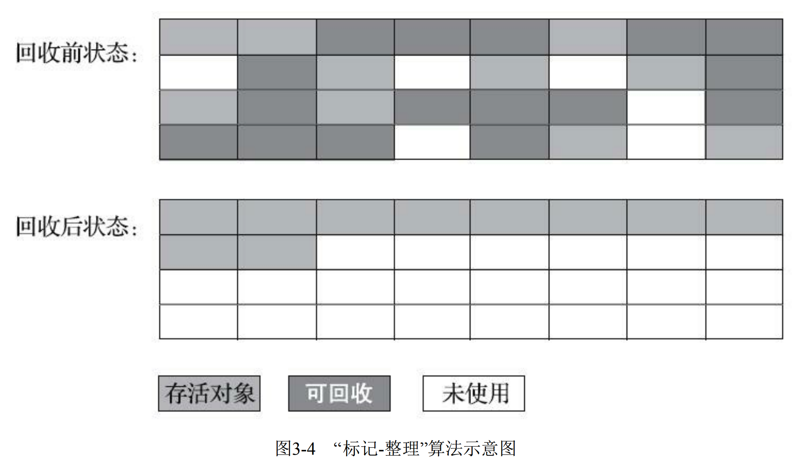

##  [HotSpot的算法细节实现]()

- 怎么定位到这个类的引用？

当用户线程停顿下来之后，其实并不需要一个不漏地检查完所有执行上下文和全局的引用位置，`虚拟机应当是有办法直接得到哪些地方存放着对象引用`的。在HotSpot的解决方案里，是使用一组称为`OopMap`的数据结构来达到这个目的。`一旦类加载动作完成的时候，HotSpot就会把对象内什么偏移量上是什么类型的数据计算出来，在即时编译过程中，也会在特定的位置记录下栈里和寄存器里哪些位置是引用。`这样收集器在扫描时就可以直接得知这些信息了，`并不需要真正一个不漏地从方法区等GC Roots开始查找`。

在OopMap的协助下，HotSpot可以快速准确地完成GC Roots枚举，HotSpot没有为每条指令都生成OopMap，只是在“特定的位置”记录
了这些信息，这些位置被称为安全点（Safepoint）。例如`方法调用、循环跳转、异常跳转`等都属于指令序列复用，所以只有具有这些功能的指令才会产生安全点。

[跨代引用和记忆集](https://www.jianshu.com/p/671495682e46)

记忆集是一种用于记录从非收集区域指向收集区域的指针集合的抽象数据结构。卡表就是记忆集的一种具体实现，它定义了记忆集的记录精度、与堆内存的映射关系等。关于卡表与记忆集的关系，读者不妨按照Java语言中HashMap与Map的关系来类比理解。

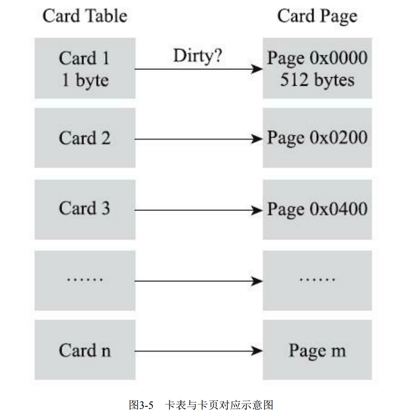


- 卡表元素如何维护的问题，例如它们何时变脏、谁来把它们变脏？

使用写屏障

- 并发的可达性分析？

`三色标记`（*Tri-color Marking*）、`增量更新（`*Incremental Update*）和`原始快照`（*Snapshot At The Beginning，SATB*）

# 经典垃圾收集器(JDK 7 - JDK 11)


[Serial收集器]()

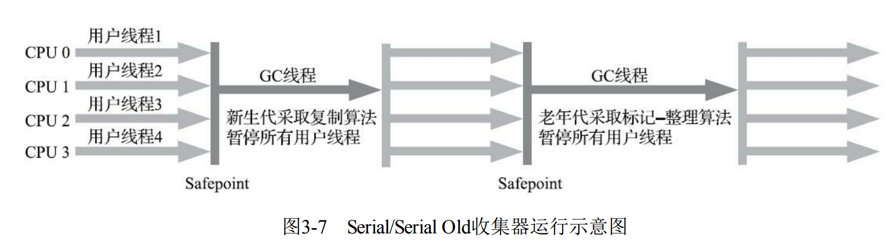

这个收集器是一个单线程工作的收集器，但它的“单线程”的意义并不仅仅是说明它只会使用一个处理器或一条收集线程去完成垃圾收集工作，更重要的是强
调在它进行垃圾收集时，`必须暂停其他所有工作线程，直到它收集结束`。

迄今为止，它依然是HotSpot虚拟机运行在客户端模式下的默认新生
代收集器，有着优于其他收集器的地方，那就是简单而高效（与其他收集器的单线程相比），对于内存资源受限的环境，它是`所有收集器里额外内存消耗`（Memory Footprint）`最小的`；

Serial收集器对于运行在`客户端模式下`的虚拟机来说是一个很好的选择。

[ParNew收集器]()

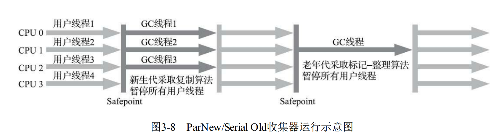

ParNew收集器实质上是Serial收集器的多线程并行版本。JDK9之前，`ParNew加CMS`收集器的组合是官方推荐的`服务端模式`下的收集器解决方案.

[Parallel Scavenge收集器]()

Parallel Scavenge收集器也是一款新生代收集器，它同样是基于`标记-复制`算法实现的收集器，也是能够并行收集的多线程收集器…

Parallel Scavenge收集器的特点是它的关注点与其他收集器不同，CMS等收集器的关注点是尽可能地缩短垃圾收集时用户线程的停顿时间，而`Parallel Scavenge收集器的目标则是达到一个可控制的吞吐量（Throughput）。`Parallel Scavenge收集器也经常被称作“`吞吐量优先收集器`”。

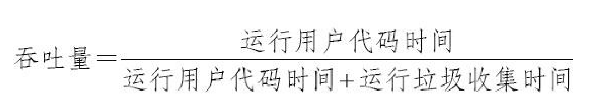

[Serial Old收集器]()

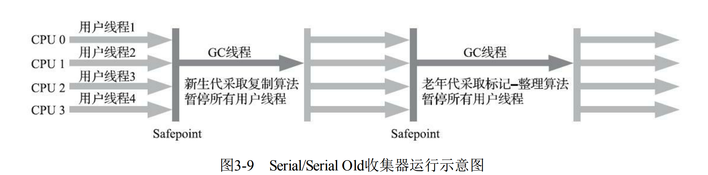

Serial Old是Serial收集器的老年代版本，它同样是一个单线程收集器，使用`标记-整理算法`。


[Parallel Old收集器]()

Parallel Old是Parallel Scavenge收集器的老年代版本，支持多线程并发收集，基于标记-整理算法实现。

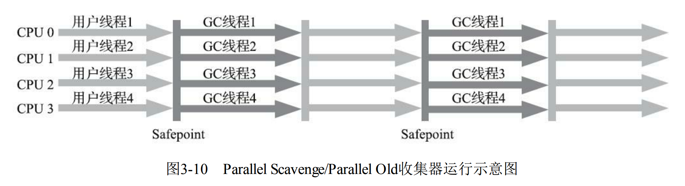

[CMS收集器]()

CMS（*Concurrent Mark Sweep*）收集器是一种`以获取最短回收停顿时间`为目标的收集器.
`基于标记-清除算法.`

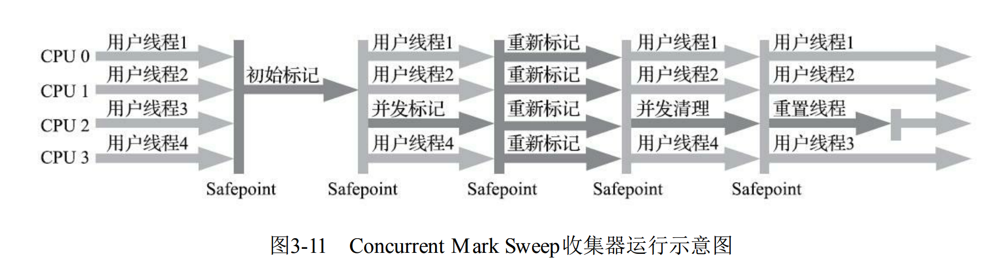

[G1]()

G1不再坚持固定大小以及固定数量的分代区域划分，而是把连续的Java堆划分为多个大小相等的独立区域（Region），每一个Region都可以根据需要，扮演新生代的Eden空间、Survivor空间，或者老年代空间。收集器能够对扮演不同角色的Region采用不同的策略去处理，这样无论是新创建的对象还是已经存活了一段时间、熬过多次收集的旧对象都能获取很好的收集效果。

G1收集器的运作过程大致可划分为以下四个步骤：
- 初始标记（Initial Marking）：仅仅只是标记一下GC Roots能直接关联到的对象，并且修改TAMS指针的值，让下一阶段用户线程并发运行时，能正确地在可用的Region中分配新对象。这个阶段需要停顿线程，但耗时很短，而且是借用进行Minor GC的时候同步完成的，所以G1收集器在这个阶段实际并没有额外的停顿。

- 并发标记（Concurrent Marking）：从GC Root开始对堆中对象进行可达性分析，递归扫描整个堆里的对象图，找出要回收的对象，这阶段耗时较长，但可与用户程序并发执行。当对象图扫描完成以后，还要重新处理SATB记录下的在并发时有引用变动的对象。
 
- 最终标记（Final Marking）：对用户线程做另一个短暂的暂停，用于处理并发阶段结束后仍遗留下来的最后那少量的SATB记录。

- 筛选回收（Live Data Counting and Evacuation）：负责更新Region的统计数据，对各个Region的回收价值和成本进行排序，根据用户所期望的停顿时间来制定回收计划，可以自由选择任意多个Region构成回收集，然后把决定回收的那一部分Region的存活对象复制到空的Region中，再清理掉整个旧Region的全部空间。这里的操作涉及存活对象的移动，是必须暂停用户线程，由多条收集器线程并行完成的。

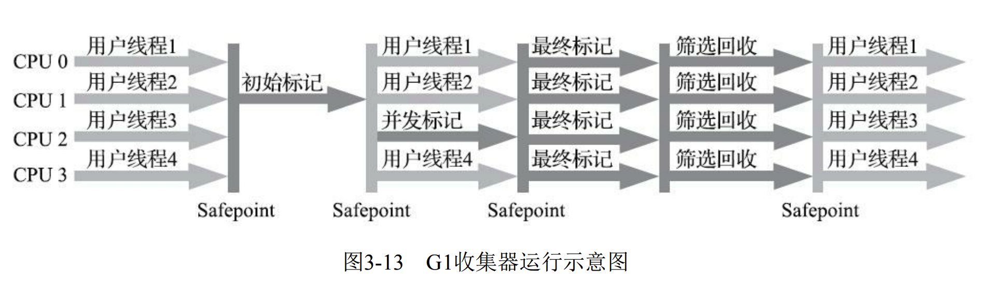

- [CMS 和G1 的区别？]()

1. 算法上，CMS使用标记清除，会产生大量碎片，而G1使用标记整理，不会产生空间碎片。

2. G1和CMS都采用卡表来处理跨代指针，G1的卡表更加复杂，每个Region都必须有一份卡表，G1的内存占用比CMS高一些。而CMS只唯一一份，只需要处理老年代到新生代的引用，节省了一些开销。

3. 小内存应用上CMS的表现大概率仍然要会优于G1，而在大内存应用上G1则大多能发挥其优势


# 低延迟垃圾收集器
Shenandoah & ZGC 略...

# 内存分配
[长期存活的对象将进入老年代]()

对象通常在Eden区里诞生，如果经过第一次Minor GC后仍然存活，并且能被Survivor容纳的话，该对象会被移动到Survivor空间中，并且将其对象年龄设为1岁。对象在Survivor区中每熬过一次Minor GC，年龄就增加1岁，当它的年龄增加到一定程度（默认为15），就会被晋升到老年代中。`如果在Survivor空间中相同年龄所有对象大小的总和大于Survivor空间的一半，年龄大于或等于该年龄的对象就可以直接进入老年代。`


# 第三部分 虚拟机执行子系统
## 类文件结构
`任何一个Class文件都对应着唯一的一个类或接口的定义信息，但是反过来说，类或接口并不一定都得定义在文件里（譬如类或接口也可以动态生成，直接送入类加载器中）。实际上它完全不需要以磁盘文件的形式存在。`

Class文件是一组以8个字节为基础单位的二进制流，Class文件格式采用一种类似于C语言结构体的伪结构来存储数据，这种伪结构中只有两种数据类型：`“无符号数”`和`“表”`。

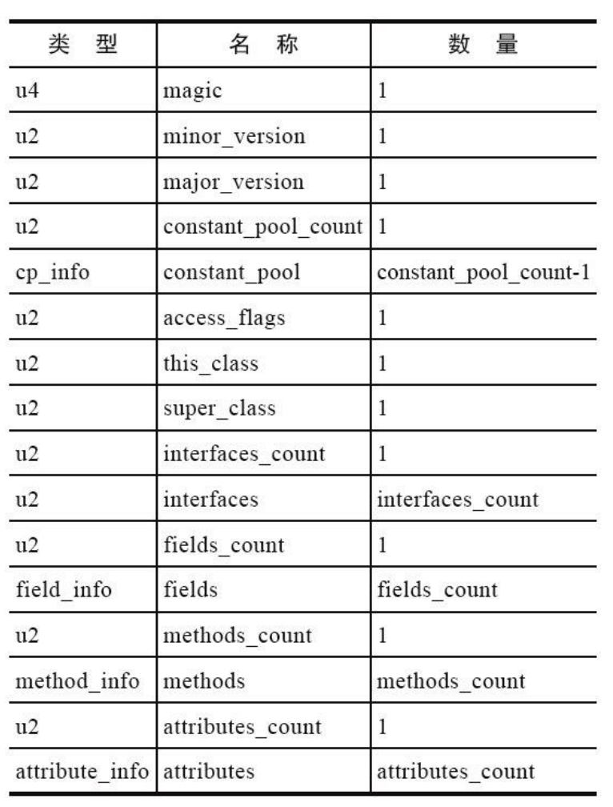

```java
Classfile /Users/loyal888/Desktop/LeetCode/src/sort/QuikSort.class
  Last modified 2021-1-17; size 832 bytes
  MD5 checksum 5dcb4f17da556795267131c2987763e2
  Compiled from "QuikSort.java"
public class sort.QuikSort
  minor version: 0
  major version: 52
  flags: ACC_PUBLIC, ACC_SUPER
Constant pool:
   #1 = Methodref          #7.#22         // java/lang/Object."<init>":()V
   #2 = Methodref          #3.#23         // sort/QuikSort.quick_sort:([III)V
   #3 = Class              #24            // sort/QuikSort
   #4 = Methodref          #3.#22         // sort/QuikSort."<init>":()V
   #5 = Fieldref           #25.#26        // java/lang/System.out:Ljava/io/PrintStream;
   #6 = Methodref          #27.#28        // java/io/PrintStream.println:(I)V
   #7 = Class              #29            // java/lang/Object
   #8 = Utf8               <init>
   #9 = Utf8               ()V
  #10 = Utf8               Code
  #11 = Utf8               LineNumberTable
  #12 = Utf8               quick_sort
  #13 = Utf8               ([III)V
  #14 = Utf8               StackMapTable
  #15 = Utf8               main
  #16 = Utf8               ([Ljava/lang/String;)V
  #17 = Class              #30            // "[Ljava/lang/String;"
  #18 = Class              #24            // sort/QuikSort
  #19 = Class              #31            // "[I"
  #20 = Utf8               SourceFile
  #21 = Utf8               QuikSort.java
  #22 = NameAndType        #8:#9          // "<init>":()V
  #23 = NameAndType        #12:#13        // quick_sort:([III)V
  #24 = Utf8               sort/QuikSort
  #25 = Class              #32            // java/lang/System
  #26 = NameAndType        #33:#34        // out:Ljava/io/PrintStream;
  #27 = Class              #35            // java/io/PrintStream
  #28 = NameAndType        #36:#37        // println:(I)V
  #29 = Utf8               java/lang/Object
  #30 = Utf8               [Ljava/lang/String;
  #31 = Utf8               [I
  #32 = Utf8               java/lang/System
  #33 = Utf8               out
  #34 = Utf8               Ljava/io/PrintStream;
  #35 = Utf8               java/io/PrintStream
  #36 = Utf8               println
  #37 = Utf8               (I)V
{
  public sort.QuikSort();
    descriptor: ()V
    flags: ACC_PUBLIC
    Code:
      stack=1, locals=1, args_size=1
         0: aload_0
         1: invokespecial #1                  // Method java/lang/Object."<init>":()V
         4: return
      LineNumberTable:
        line 5: 0

  public void quick_sort(int[], int, int);
    descriptor: ([III)V
    flags: ACC_PUBLIC
    Code:
      stack=4, locals=8, args_size=4
         0: iload_2
         1: iload_3
         2: if_icmplt     6
         5: return
         6: iload_2
         7: iconst_1
         8: isub
         9: istore        4
        11: iload_3
        12: iconst_1
        13: iadd
        14: istore        5
        16: aload_1
        17: iload_2
        18: iload_3
        19: iadd
        20: iconst_1
        21: ishr
        22: iaload
        23: istore        6
        25: iload         4
        27: iload         5
        29: if_icmpge     86
        32: iinc          4, 1
        35: aload_1
        36: iload         4
        38: iaload
        39: iload         6
        41: if_icmplt     32
        44: iinc          5, -1
        47: aload_1
        48: iload         5
        50: iaload
        51: iload         6
        53: if_icmpgt     44
        56: iload         4
        58: iload         5
        60: if_icmpge     25
        63: aload_1
        64: iload         4
        66: iaload
        67: istore        7
        69: aload_1
        70: iload         4
        72: aload_1
        73: iload         5
        75: iaload
        76: iastore
        77: aload_1
        78: iload         5
        80: iload         7
        82: iastore
        83: goto          25
        86: aload_0
        87: aload_1
        88: iload_2
        89: iload         5
        91: invokevirtual #2                  // Method quick_sort:([III)V
        94: aload_0
        95: aload_1
        96: iload         5
        98: iconst_1
        99: iadd
       100: iload_3
       101: invokevirtual #2                  // Method quick_sort:([III)V
       104: return
      LineNumberTable:
        line 7: 0
        line 9: 6
        line 10: 11
        line 11: 16
        line 13: 25
        line 16: 32
        line 17: 35
        line 21: 44
        line 22: 47
        line 25: 56
        line 26: 63
        line 27: 69
        line 28: 77
        line 29: 83
        line 31: 86
        line 32: 94
        line 33: 104
      StackMapTable: number_of_entries = 5
        frame_type = 6 /* same */
        frame_type = 254 /* append */
          offset_delta = 18
          locals = [ int, int, int ]
        frame_type = 6 /* same */
        frame_type = 11 /* same */
        frame_type = 41 /* same */

  public static void main(java.lang.String[]);
    descriptor: ([Ljava/lang/String;)V
    flags: ACC_PUBLIC, ACC_STATIC
    Code:
      stack=4, locals=7, args_size=1
         0: new           #3                  // class sort/QuikSort
         3: dup
         4: invokespecial #4                  // Method "<init>":()V
         7: astore_1
         8: bipush        6
        10: newarray       int
        12: dup
        13: iconst_0
        14: iconst_3
        15: iastore
        16: dup
        17: iconst_1
        18: iconst_2
        19: iastore
        20: dup
        21: iconst_2
        22: iconst_1
        23: iastore
        24: dup
        25: iconst_3
        26: iconst_3
        27: iastore
        28: dup
        29: iconst_4
        30: bipush        45
        32: iastore
        33: dup
        34: iconst_5
        35: iconst_0
        36: iastore
        37: astore_2
        38: aload_1
        39: aload_2
        40: iconst_0
        41: iconst_5
        42: invokevirtual #2                  // Method quick_sort:([III)V
        45: aload_2
        46: astore_3
        47: aload_3
        48: arraylength
        49: istore        4
        51: iconst_0
        52: istore        5
        54: iload         5
        56: iload         4
        58: if_icmpge     81
        61: aload_3
        62: iload         5
        64: iaload
        65: istore        6
        67: getstatic     #5                  // Field java/lang/System.out:Ljava/io/PrintStream;
        70: iload         6
        72: invokevirtual #6                  // Method java/io/PrintStream.println:(I)V
        75: iinc          5, 1
        78: goto          54
        81: return
      LineNumberTable:
        line 36: 0
        line 37: 8
        line 38: 38
        line 40: 45
        line 41: 67
        line 40: 75
        line 43: 81
      StackMapTable: number_of_entries = 2
        frame_type = 255 /* full_frame */
          offset_delta = 54
          locals = [ class "[Ljava/lang/String;", class sort/QuikSort, class "[I", class "[I", int, int ]
          stack = []
        frame_type = 248 /* chop */
          offset_delta = 26
}
SourceFile: "QuikSort.java"
```

[魔数与Class文件的版本]()

每个Class文件的头4个字节被称为魔数（Magic Number），它的唯一作用是确定这个文件是否为一个能被虚拟机接受的Class文件。

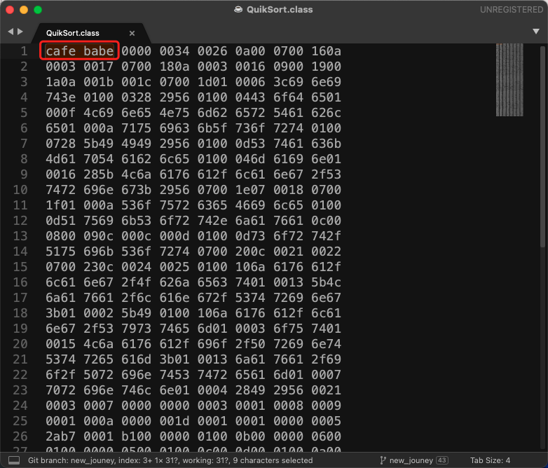

[次版本号]()

[主版本号]()

[常量池]()
由于常量池中常量的数量是不固定的，所以在常量池的入口需要放置一项u2类型的数据，代表`常量池容量计数值（constant_pool_count）`。

常量池中主要存放两大类常量：`字面量（Literal）`和符号引用`（Symbolic References）`。

符号引用包括:

·被模块导出或者开放的包（Package）

·类和接口的全限定名（Fully Qualified Name）

·字段的名称和描述符（Descriptor）

·方法的名称和描述符

·方法句柄和方法类型（Method Handle、Method Type、Invoke Dynamic）

·动态调用点和动态常量（Dynamically-Computed Call Site、Dynamically-Computed Constant）

Java代码在进行Javac编译的时候，并不像C和C++那样有“连接”这一步骤，而是在虚拟机加载Class文件的时候进行动态连接。也就是说，在Class文件中不会保存各个方法、字段最终
在内存中的布局信息，这些字段、方法的符号引用不经过虚拟机在运行期转换的话是无法得到真正的内存入口地址，也就无法直接被虚拟机使用的。当虚拟机做类加载时，将会从常量池获得对应的`符号引用，再在类创建时或运行时解析、翻译到具体的内存地址之中`。

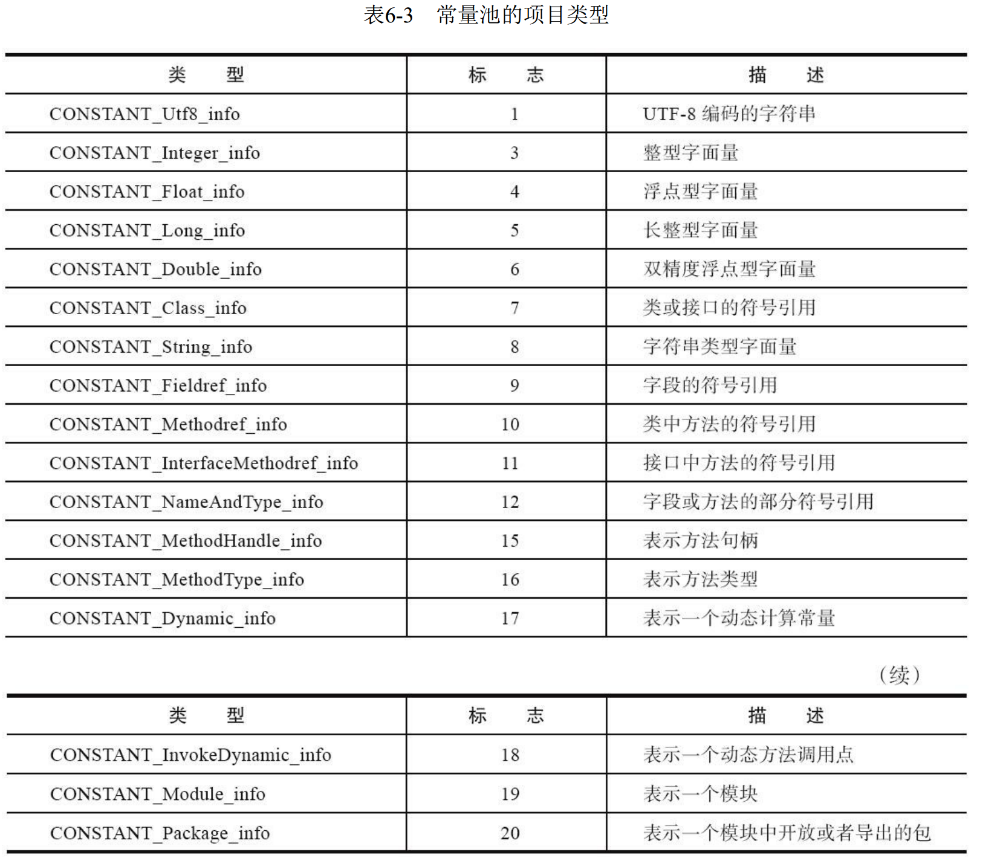

*常量池的17种类型*

[访问标志]()
在常量池结束之后，紧接着的2个字节代表访问标识（*access_flags*），这个标志用于识别一些类或者接口层次的访问信息，包括：这个Class是类还是接口；是否定义为public类型；是否定义为abstract类型；如果是类的话，是否被声明为final；

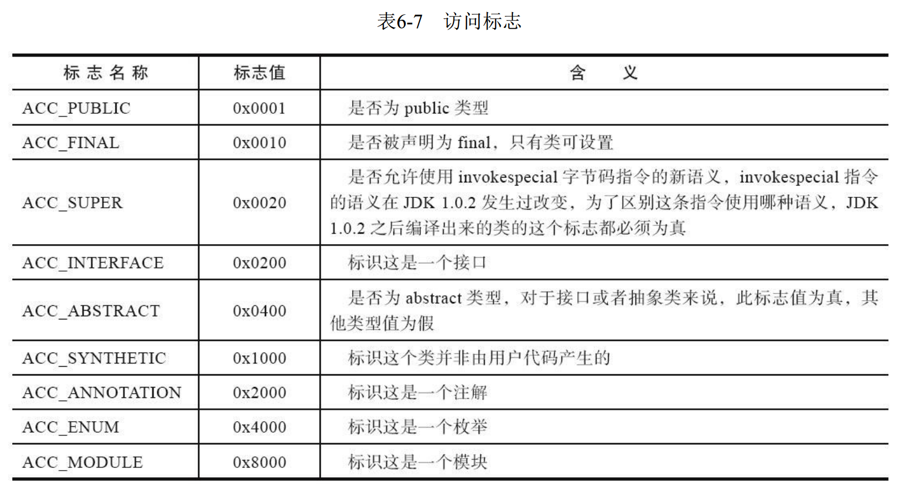

[类索引、父类索引与接口索引集合]()

`类索引（this_class）`和`父类索引（super_class）`都是一个u2类型的数据，而`接口索引集合（interfaces）`是一组u2类型的数据的集合，Class文件中由这三项数据来确定该类型的继承关系。类索引用于确定这个类的全限定名，父类索引用于确定这个类的父类的全限定名。由于Java语言不允许多重继承，所以父类索引只有一个，除了java.lang.Object外，所有的Java类都有父类，因此除了java.lang.Object外，所有Java类的父类索引都不为0。口索引集合就用来描述这个类实现了哪些接口，这些被实现的接口将按implements关键字（如果这个Class文件表示的是一个接口，则应当是extends关键字）后的接口顺序从左到右排列在接口索引集合中。

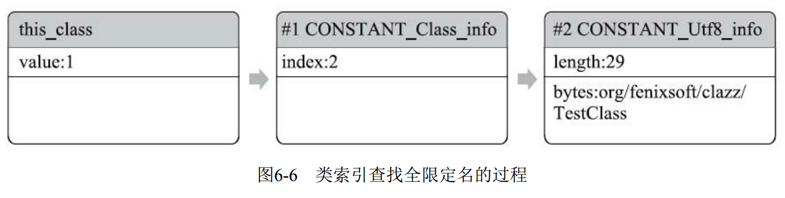

[字段表集合]()

`字段表（field_info）`用于描述`接口或者类中声明的变量`。Java语言中的“字段”（Field）包括`类级变量`以及`实例`级变量，但不包括在方法内部声明的局部变量。

字段可以包括的`修饰符有字段的作用域`（public、private、protected修饰符）、是实例变量还是类变量（`static修饰符`）、可变性（`final`）、并发可见性（`volatile`修饰符，是否强制从主内存读写）、可否被序列化（`transient`修饰符）、字段`数据类型`（基本类型、对象、数组）、`字段名称`。

[方法表集合]()

方法表的结构如同字段表一样，依次包括访问标志（access_flags）、名称索引（name_index）、描述符索引（descriptor_index）、属性表集合（attributes）几项.

[属性表集合]()

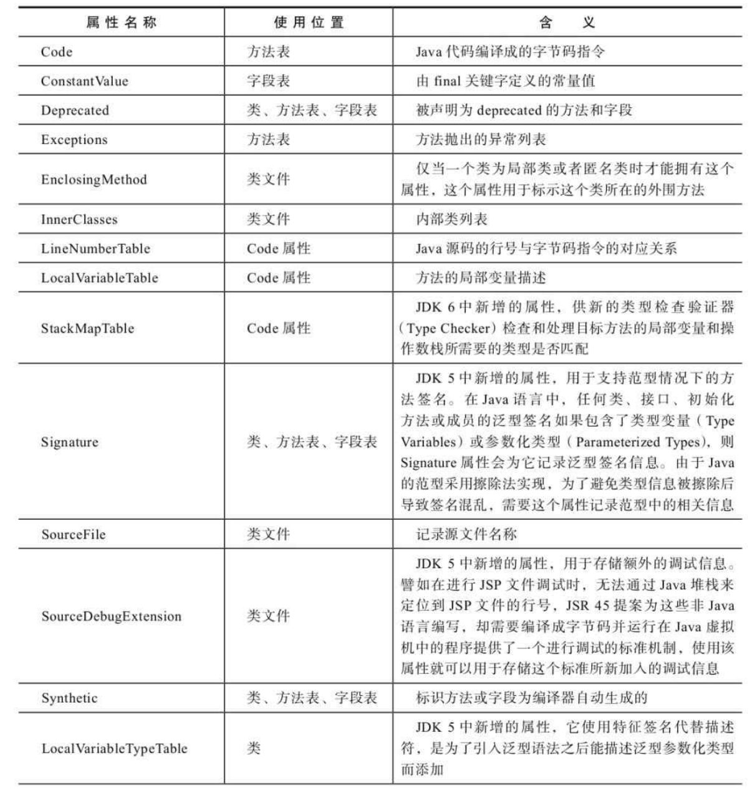

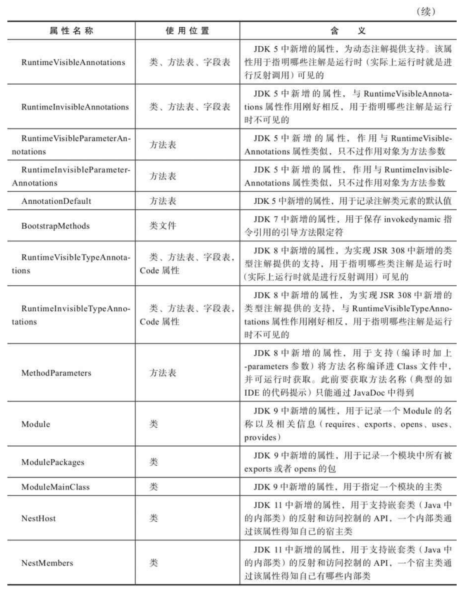

### 字节码指令

对于大部分与数据类型相关的字节码指令，它们的操作码助记符中都有特殊的字符来表明专门为哪种数据类型服务：`i代表对int类型的数据操作`，`l代表long`，`s代表short`，`b代表byte`，`c代表char`，`f代表float`，`d代表double`，`a代表reference`。即并非每种数据类型和每一种操作都有对应的指令。

**java虚拟机指令集所支持的数据类型**

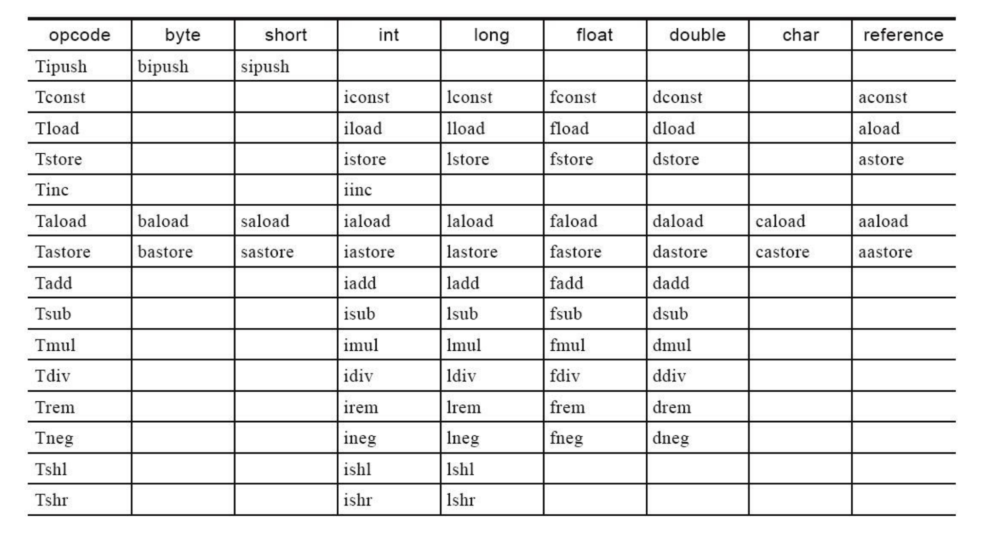

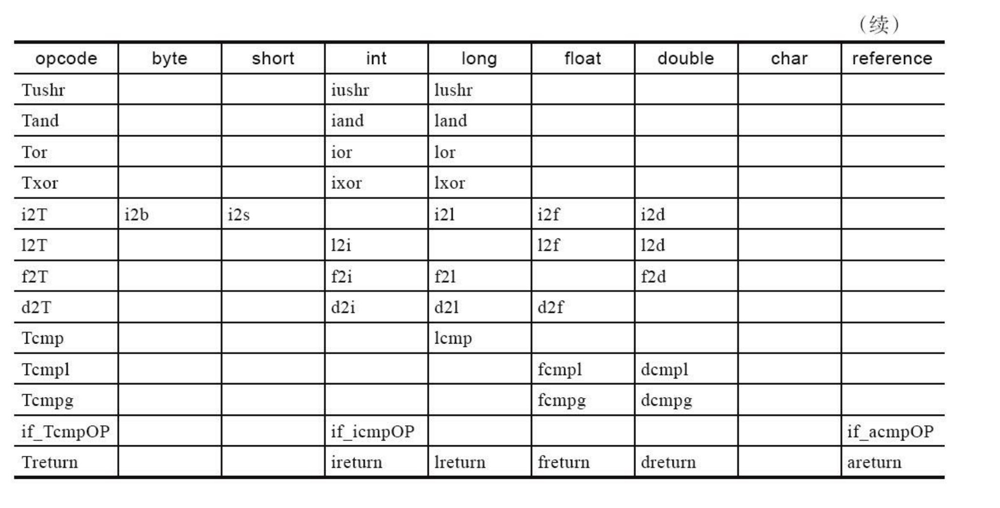

- 编译器会在编译期或运行期将`byte和short`类型的数据`带符号扩展（Sign-Extend）`为
相应的int类型数据，将`boolean和char`类型数据`零位扩展（Zero-Extend）`为相应的int类型数据。

---

- 数据运算可能会导致溢出，`例如两个很大的正整数相加，结果可能会是一个负数`，这种数学上不可能出现的溢出现象，《Java虚拟机规范》中并没有明确定义过整型数据溢出具体会得到什么计算结果，仅规定了在处理整型数据时，只有`除法指令（idiv和ldiv）以及求余指令（irem和lrem）`中当出现除数为零时会导致虚拟机抛出ArithmeticException异常，其余任何整型数运算场景都不应该抛出运行时异常。

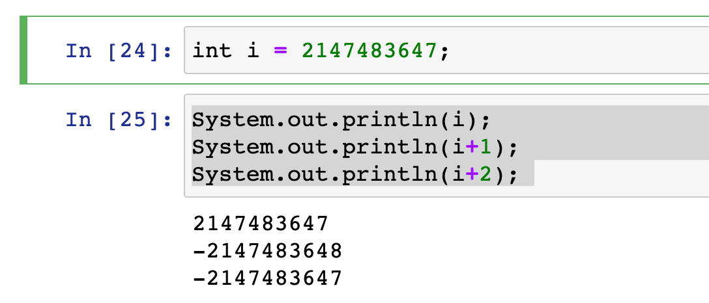
---

- 指令可以分为`加载和存储指令`、`运算指令`、`类型转换指令`、`对象创建与访问指令`、`操作数栈管理指令`、`控制转移指令`、`方法调用和返回指令`、`异常处理指令`、`同步指令`

**对象创建与访问指令**
>
> ·创建类实例的指令：`new`
>
> ·创建数组的指令：`newarray`、`anewarray`、`multianewarray`
>
> ·访问类字段（static字段，或者称为类变量）和实例字段（非static字段，或者称为实例变量）的指令：`getfield`、`putfield`、`getstatic`、`putstatic`
>
> ·把一个数组元素加载到操作数栈的指令：`baload`、`caload`、`saload`、`iaload`、`laload`、`faload`、
`daload`、`aaload`
>
> ·将一个操作数栈的值储存到数组元素中的指令：`bastore、castore、sastore、iastore、fastore、
dastore、aastore`
>
> ·取数组长度的指令：`arraylength`
>
> ·检查类实例类型的指令：`instanceof`、`checkcast`

**操作数栈管理指令**

Java虚拟机提供了一些用于直接操作操作数栈的指令，包括：

·将操作数栈的栈顶一个或两个元素出栈：`pop`、`pop2`

·复制栈顶一个或两个数值并将复制值或双份的复制值重新压入栈顶：`dup、dup2、dup_x1、
dup2_x1、dup_x2、dup2_x2`

·将栈最顶端的两个数值互换：`swap`

**控制转移指令**

控制转移指令包括：

·条件分支：ifeq、iflt、ifle、ifne、ifgt、ifge、ifnull、ifnonnull、if_icmpeq、if_icmpne、if_icmplt、
if_icmpgt、if_icmple、if_icmpge、if_acmpeq和if_acmpne

·复合条件分支：tableswitch、lookupswitch

·无条件分支：goto、goto_w、jsr、jsr_w、ret

**方法调用和返回指令**

·`invokevirtual`指令：用于`调用对象的实例方法`，根据对象的实际类型进行分派（虚方法分派），这也是Java语言中最常见的方法分派方式。

·invokeinterface指令：用于调用接口方法，它会在运行时搜索一个实现了这个接口方法的对象，找出适合的方法进行调用。

·invokespecial指令：用于调用一些需要特殊处理的实例方法，`包括实例初始化方法、私有方法和父类方法。`

·invokestatic指令：用于调用类静态方法（static方法）。

·invokedynamic指令：用于在运行时动态解析出调用点限定符所引用的方法。并执行该方法。前面四条调用指令的分派逻辑都固化在Java虚拟机内部，用户无法改变，而invokedynamic指令的分派逻辑是由用户所设定的引导方法决定的。

方法调用指令与数据类型无关，而方法返回指令是根据返回值的类型区分的，包括`ireturn`（当返回值是boolean、byte、char、short和int类型时使用）、`lreturn、freturn、dreturn和areturn`

**异常处理指令**
- 显式抛出异常的操作（throw语句）都由athrow指令来实现

- 处理异常（catch语句）采用异常表来完成。

**同步指令**

Java虚拟机可以支持`方法级的同步`和方法内部一段`指令序列的同步`，这两种同步结构都是使用锁（Monitor，更常见的是直接将它称为“锁”）来实现的。

虚拟机可以从方法常量池中的方法表结构中的`ACC_SYNCHRONIZED`访问标志得知一个方法是否被声明为同步方法。当方法调用时，调用指令将会检查方法的ACC_SYNCHRONIZED访问标志是否被设置，如果设置了，执行线程就要求先成功持有锁，然后才能执行方法，最后当方法完成（无论是正常完成还是非正常完成）时释放锁。在方法执行期间，执行线程持有了管程，其他任何线程都无法再获取到同一个管程。`如果一个同步方法执行期间抛出了异常，并且在方法内部无法处理此异常`，那这个同步方法所持有的锁将在异常抛到`同步方法边界之外`时自动释放。

同步一段指令集序列通常是由Java语言中的`synchronized`语句块来表示的，Java虚拟机的指令集中有`monitorenter`和`monitorexit`两条指令来支持synchronized关键字的语义，正确实现synchronized关键字
需要Javac编译器与Java虚拟机两者共同协作支持.

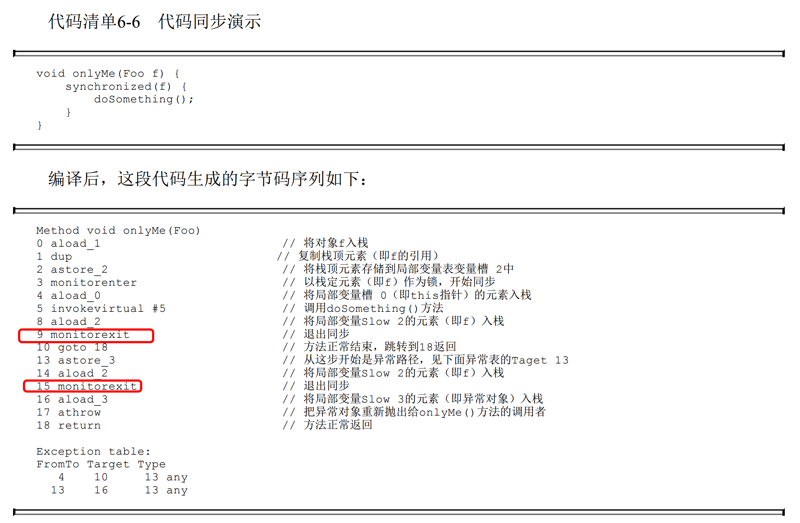

为了保证在方法异常完成时monitorenter和monitorexit指
令依然可以正确配对执行，编译器会自动产生一个异常处理程序，这个异常处理程序声明可处理所有的异常，它的目的就是用来执行`monitorexit`指令。


# 虚拟机类加载机制

Java虚拟机把描述类的数据从Class文件加载到内存，并对数据进行校验、转换解析和初始化，最终形成可以被虚拟机直接使用的Java类型，这个过程被称作虚拟机的类加载机制。

## 类加载的时机

类生命周期将会经历`加载（Loading）`、`验证（Verification）`、`准备（Preparation）`、`解析（Resolution）`、`初始化（Initialization）`、`使用（Using）`和`卸载（Unloading）`七个阶段，其中验证、准备、解析三个部分统称为`连接（Linking）`。

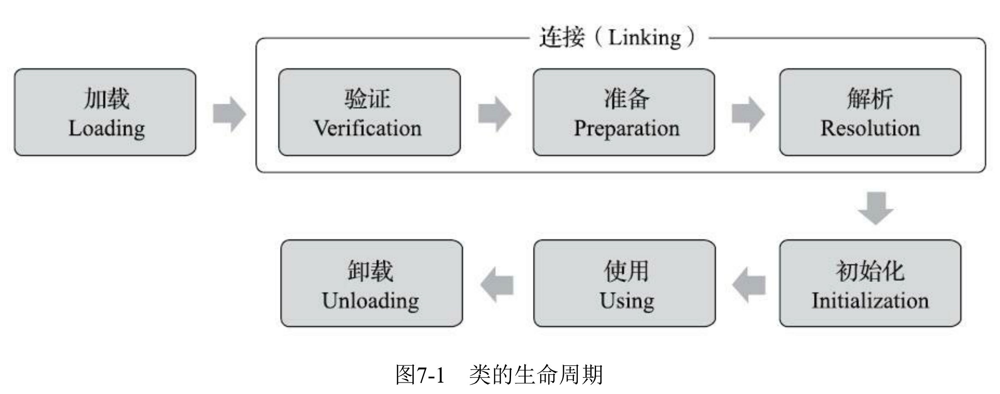

[类进行初始化]()

1）遇到new、getstatic、putstatic或invokestatic这四条字节码指令时，如果类型没有进行过初始化，则需要先触发其初始化阶段。能够生成这四条指令的典型Java代码场景有：

·使用new关键字实例化对象的时候。

·读取或设置一个类型的静态字段（被final修饰、已在编译期把结果放入常量池的静态字段除外）的时候。

·调用一个类型的静态方法的时候。

**2）使用java.lang.reflect包的方法对类型进行反射调用的时候，如果类型没有进行过初始化，则需要先触发其初始化。**

3）当初始化类的时候，如果发现其父类还没有进行过初始化，则需要先触发其父类的初始化。

**4）当虚拟机启动时，用户需要指定一个要执行的主类（包含main()方法的那个类），虚拟机会先初始化这个主类。**

5）当使用JDK 7新加入...

**6）当一个接口中定义了JDK 8新加入的默认方法（被`default`关键字修饰的接口方法）时，如果有这个接口的实现类发生了初始化，那`该接口要在其之前被初始化`。**

# 类加载的过程

## 加载

在加载阶段，Java虚拟机需要完成以下三件事情：
**1）通过一个类的全限定名来获取定义此类的二进制字节流。**

2）将这个字节流所代表的静态存储结构转化为方法区的运行时数据结构。

**3）在内存中生成一个代表这个类的java.lang.Class对象，作为方法区这个类的各种数据的访问入口。**

> 对于数组类而言，数组类本身不通过类加载器创建，它是由Java虚拟机直接在内存中动态构造出来的。

- 加载阶段结束后，Java虚拟机外部的二进制字节流就按照虚拟机所设定的格式存储在`方法区`之中了，方法区中的数据存储格式完全由虚拟机实现自行定义，《Java虚拟机规范》未规定此区域的具体数据结构。

- 类型数据妥善安置在方法区之后，`会在Java堆内存中实例化一个java.lang.Class类的对象，这个对象将作为程序访问方法区中的类型数据的外部接口`。

## 验证
验证是连接阶段的第一步，这一阶段的目的是`确保Class文件的字节流中包含的信息符合`《Java虚拟机规范》的全部约束要求，保证这些信息被当作代码运行后不会危害虚拟机自身的安全。

验证阶段大致上会完成下面四个阶段的检验动作：`文件格式验证`、`元数据验证`、`字节码验证`和`符号引用验证`。

[1.文件格式验证]()

第一阶段要验证字节流是否符合Class文件格式的规范，并且能被当前版本的虚拟机处理。该验证阶段的主要目的是保证输入的字节流能正确地解析并存储于方法区之内，格式上符
合描述一个Java类型信息的要求。

[2.元数据验证]()

第二阶段是对`字节码`描述的信息进行`语义分析`.

[3.字节码验证]()

第三阶段主要目的是通过数据流分析和控制流分析，确定程序语义是合法的、符合逻辑的。对类的`方法体（Class文件中的Code属性）`进行校验分析，保证被校验类的方法在运行时不会做出危害虚拟机安全的行为。

[4.符号引用验证]()

最后一个阶段的校验行为发生在虚拟机`将符号引用转化为直接引用`的时候，这个转化动作将在连接的第三阶段——解析阶段中发生。看该类是否缺少或者被禁止访问它依赖的某些外部
类、方法、字段等资源。`java.lang.NoSuchMethodError`就是在此处抛出的。

## 准备

准备阶段是正式`为类中定义的变量（即静态变量，被static修饰的变量，仅包括类变量，而不包括实例变量）`分配内存并设置类变量初始值的阶段。

如果类字段的字段属性表中存在ConstantValue属性，那在准备阶段变量值就会被初始化为ConstantValue属性所指定的初始值。非常量静态属性要到类的初始化阶段(类构造器<clinit>()方法)才会被执行。

## 解析

解析阶段是`Java虚拟机将常量池内的符号引用替换为直接引用的过程`。

·符号引用（Symbolic References）：符号引用以一组符号来描述所引用的目标，符号可以是任何形式的字面量，只要使用时能无歧义地定位到目标即可。在Class文件中它以`CONSTANT_Class_info`、`CONSTANT_Fieldref_info`、`CONSTANT_Methodref_info`、`CONSTANT_InterfaceMethodref_info`等类型的常量出现。

·直接引用（Direct References）：直接引用是可以`直接指向目标的指针`、相对偏移量或者是一个能间接定位到目标的句柄。直接引用是和虚拟机实现的内存布局直接相关的，同一个符号引用在不同虚拟机实例上翻译出来的直接引用一般不会相同。如果有了直接引用，那引用的目标必定已经在虚拟机的内存中存在。

[1.类或接口的解析]()

1）如果C不是一个数组类型，那虚拟机将会把代表N的全限定名传递给D的类加载器去加载这个
类C。在加载过程中，由于元数据验证、字节码验证的需要，又可能触发其他相关类的加载动作，例如加载这个类的父类或实现的接口。一旦这个加载过程出现了任何异常，解析过程就将宣告失败。

2）如果C是一个数组类型，并且数组的元素类型为对象，也就是N的描述符会是类
似“[Ljava/lang/Integer”的形式，那将会按照第一点的规则加载数组元素类型。如果N的描述符如前面所假设的形式，需要加载的元素类型就是“java.lang.Integer”，接着由虚拟机生成一个代表该数组维度和元素的数组对象。

3）如果上面两步没有出现任何异常，那么C在虚拟机中实际上已经成为一个有效的类或接口了，但在解析完成前还要进行符号引用验证，确认D是否具备对C的访问权限。如果发现不具备访问权限，将抛出java.lang.IllegalAccessError异常。

[2.字段解析]()

对字段表内class_index项中索引的`CONSTANT_Class_info`符号引用进行解析，也就是字段所属的类或接口的符号引用。

[3.方法解析]()

1）由于Class文件格式中类的方法和接口的方法符号引用的常量类型定义是分开的，如果在类的方法表中发现class_index中索引的C是个接口的话，那就直接抛出java.lang.IncompatibleClassChangeError异常。

2）如果通过了第一步，在类C中查找是否有简单名称和描述符都与目标相匹配的方法，如果有则返回这个方法的直接引用，查找结束。

3）否则，在类C的父类中递归查找是否有简单名称和描述符都与目标相匹配的方法，如果有则返回这个方法的直接引用，查找结束。

4）否则，在类C实现的接口列表及它们的父接口之中递归查找是否有简单名称和描述符都与目标相匹配的方法，如果存在匹配的方法，说明类C是一个抽象类，这时候查找结束，抛出
java.lang.AbstractMethodError异常。

5）否则，宣告方法查找失败，抛出java.lang.NoSuchMethodError。

[4.接口方法解析]()

先解析出接口方法表的class_index项中索引的方法所属的类或接口的符号引
用，如果解析成功，依然用C表示这个接口。

从自己或父类中取找到相应的方法。

## 初始化
初始化阶段就是执行类构造器<clinit>()方法的过程。

·<clinit>()方法是由编译器自动收集类中的所有`类变量的赋值动作`和`静态语句块`（static{}块）中的语句合并产生的，编译器收集的顺序是由语句在源文件中出现的顺序决定的，静态语句块中只能访问到定义在静态语句块之前的变量，定义在它之后的变量，在前面的静态语句块可以赋值，但是不能访问。

如果一个类中没有静态语句块，也没有对变量的赋值操作，那么编译器可以不为这个类生成<clinit>()方法。

# 类加载器

## 类于类加载器

对于任意一个类，都必须`由加载它的类加载器和这个类本身一起共同确立其在Java虚拟机中的唯一性`，每一个类加载器，都拥有一个独立的类名称空间。这句话可以表达得更通俗一些：比较两个类是否“相等”，只有在这两个类是由同一个类加载器加载的前提下才有意义，否则，即使这两个类来源于同一个Class文件，被同一个Java虚拟机加载，只要加载它们的类加载器不同，那这两个类就必定不相等。

## 双亲委派模型
- 在Java虚拟机的角度来看，只存在两种不同的类加载器：一种是`启动类加载器`（*Bootstrap ClassLoader*），这个类加载器使用C++语言实现，是虚拟机自身的一部分；另外一种就是其他所有的类加载器，这些类加载器都`由Java语言实现`，独立存在于虚拟机外部，并且全都继承自抽象类java.lang.ClassLoader。

- 在Java开发人员的角度来看,载器就应当划分得更细致一些。Java一直保
持着`三层类加载器`、`双亲委派的类加载架构`。

### 三层类加载器
[启动类加载器（Bootstrap Class Loader）]()

使用C++语言实现,负责加载存放在<JAVA_HOME>\lib目录,而且是Java虚拟机能够
识别的类库加载到虚拟机的内存中。

[扩展类加载器（Extension Class Loader）]()

以Java代码的形式实现的,它负责加载<JAVA_HOME>\lib\ext目录中，或者被java.ext.dirs系统变量所指定的路径中所有的类库。开发者可以直接在程序中使用`扩展类加载器`来加载Class文件。

[应用程序类加载器（Application Class Loader）]()

以Java代码的形式实现的,由于应用程序类加载器是ClassLoader类中的`getSystemClassLoader()`方法的返回值，所以有些场合中也称它为“系统类加载器”。它负责加载`用户类路径`（ClassPath）上所有的类库，开发者同样可以直接在代码中使用这个类加载器。

### 双亲委派模型
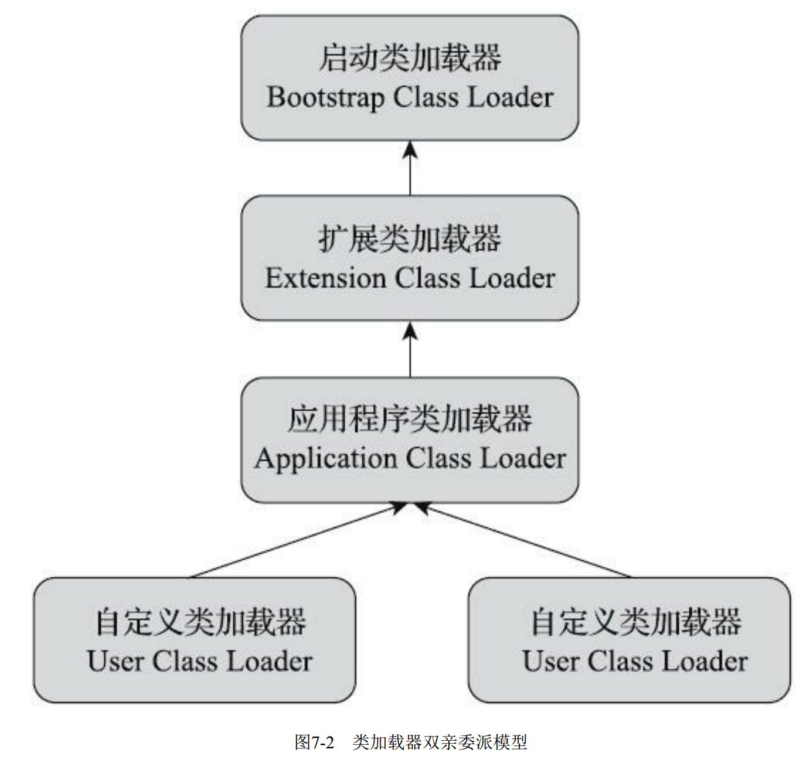
`JDK 9`之前的Java应用都是由这三种类加载器互相配合来完成加载的，如果用户认为有必要，还可以加入`自定义的类加载器`来进行拓展，典型的如增加除了磁盘位置之外的Class文件来源，或者通过类加载器实现类的隔离、重载等功能。

双亲委派模型要求除了顶层的启动类加载器外，其余的类加载器都应有自己的父类加载
器。通常使用`组合（Composition）`关系来复用父加载器的代码。

工作过程是：如果一个类加载器收到了类加载的请求，它首先不会自己去尝试加
载这个类，而是把这个请求委派给父类加载器去完成，每一个层次的类加载器都是如此，因此所有的加载请求最终都应该传送到最顶层的启动类加载器中，只有当父加载器反馈自己无法完成这个加载请求（它的搜索范围中没有找到所需的类）时，子加载器才会尝试自己去完成加载。

# 虚拟机字节码执行引擎

## 运行时栈帧结构

Java虚拟机以`方法`作为最基本的执行单元，`“栈帧”（Stack Frame）`则是用于支持虚拟机进行方法调用和方法执行背后的数据结构，它也是虚拟机运行时数据区中的`虚拟机栈（Virtual Machine Stack）`的栈元素。`栈帧存储了方法的局部变量表、操作数栈、动态连接和方法返回地址等信息。`

<font color="red">虚拟机栈示意图</font>
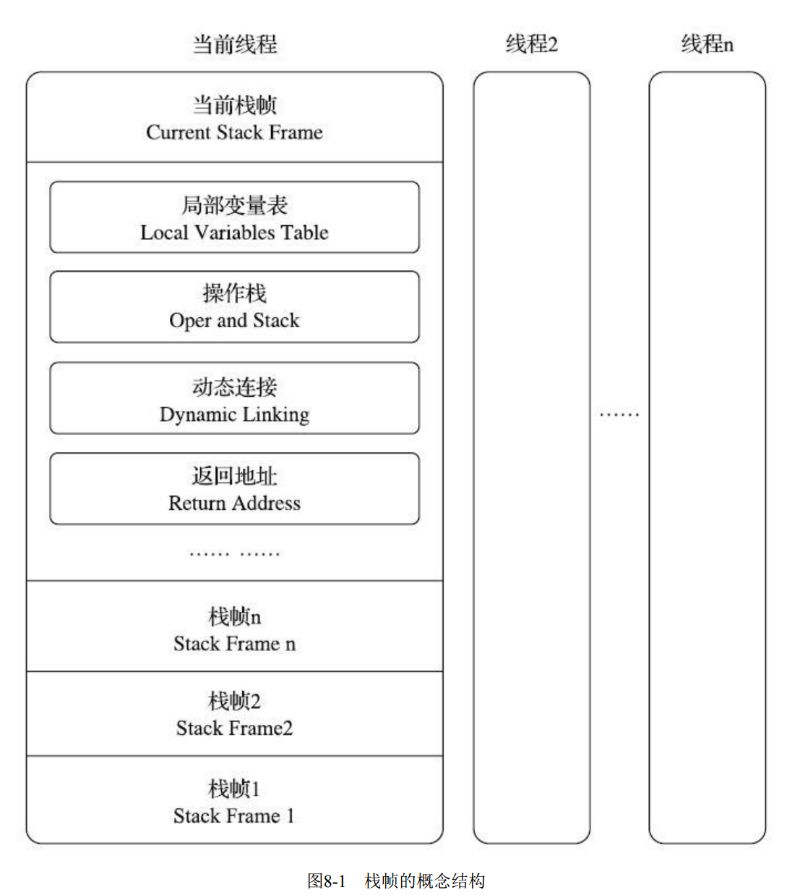

[局部变量表]()

局部变量表的容量以`变量槽（Variable Slot）`为最小单位.一个变量槽可以存放一个32位以内的数据类型，Java中占用不超过32位存储空间的数据类型有boolean、byte、char、short、int、float、reference和returnAddress这8种类型。

虚拟机实现至少都应当能通过这个引用做到两件事情，一是从根据引用直接或间接地查找到对象在Java堆中的数据存放的起始地址或索引，二是根据引用直接或间接地查找到对象所属数据类型在方法区中的存储的类型信息，否则将无法实现《Java语言规范》中定义的语法约定[。

第8种returnAddress类型目前已经很少见了，它是为字节码指令jsr、jsr_w和ret服务的，指向了一条字节码指令的地址，某些很古老的Java虚拟机曾经使用这几条指令来实现异常处理时的跳转，但现在也已经全部改为采用异常表来代替了。

对于64位的数据类型，Java虚拟机会以高位对齐的方式为其分配两个连续的变量槽空间。Java语言中明确的64位的数据类型只有long和double两种。

`局部变量表是线程私有，不存在线程安全问题。`

当一个方法被调用时，Java虚拟机会使用局部变量表来完成参数值到参数变量列表的传递过程，即`实参到形参的传递`。

当一个方法被调用时，Java虚拟机会使用局部变量表来完成参数值到参数变量列表的传递过程，即实参到形参的传递。如果执行的是实例方法（没有被static修饰的方法），`那局部变量表中第0位索引的变量槽默认是用于传递方法所属对象实例的引用，在方法中可以通过关键字“this”来访问到这个隐含的参数。`其余参数则按照参数表顺序排列，占用从1开始的局部变量槽，参数表分配完毕后，再根据方法体内部定义的变量顺序和作用域分配其余的变量槽。

[操作数栈]()
操作数栈（Operand Stack）也常被称为操作栈，它是一个后入先出（Last In First Out，LIFO）栈。同局部变量表一样，操作数栈的最大深度也在编译的时候被写入到Code属性的`max_stacks`数据项
之中。

操作数栈的每一个元素都可以是包括long和double在内的任意Java数据类型。

32位数据类型所占的栈容量为1，64位数据类型所占的栈容量为2。

`当一个方法刚刚开始执行的时候，这个方法的操作数栈是空的，在方法的执行过程中，会有各种字节码指令往操作数栈中写入和提取内容，也就是出栈和入栈操作。`

<font color="red">Java虚拟机的解释执行引擎被称为“基于栈的执行引擎”，里面的“栈”就是操作数栈。</font>

- 与基于寄存器的执行引擎有哪些差别?

[动态连接]()
每个栈帧都包含一个<font color="red">指向运行时常量池中该栈帧所属方法的引用</font>，持有这个引用是为了支持方法调用过程中的动态连接（Dynamic Linking）。

符号引用一部分会在类加载阶段或者第一次使用的时候就被转化为直接引用，这种转化被称为静态解析。另外一部分将在每一次运行期间都转化为直接引用，这部分就称为动态连接。

[返回地址]()
方法正常退出时，主调方法的PC计数器的值就可以作为返回地址，栈帧中很可能会保存这个计数器值。

而方法异常退出时，返回地址是要通过异常处理器表来确定的，栈帧中就一般不会保存这部分信息。

退出时可能执行的操作有：恢复上层方法的局部变量表和操作数栈，把返回值（如果有的话）压入调用者栈帧的操作数栈中，调整PC计数器的值
以指向方法调用指令后面的一条指令等。

# 方法调用