# 顶级接口：Map & Collection
## Map
map分为无序和有序两种
### 无序Map
#### HashMap
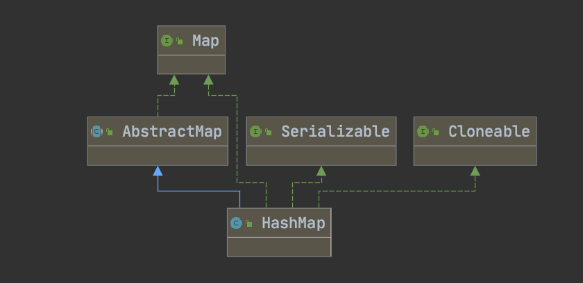

* 源码分析
-  https://juejin.im/post/6844903799748821000
-  https://segmentfault.com/a/1190000015812438
-  https://andihappy.github.io/2019/08/03/hashmap/

#### LinkedHashMap
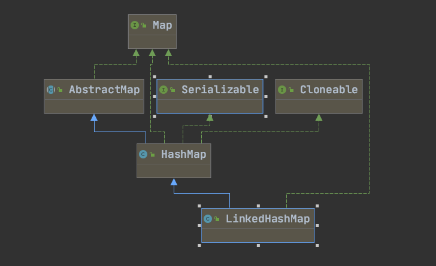


- 源码分析

[LinkedHashMap结构分析](https://www.bookstack.cn/read/jdk_source_learning/src-LinkedHashMap.md)

#### WeakHashMap
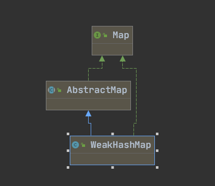

[为什么WeakHashMap可以被回收？](http://ifeve.com/java-reference%E6%A0%B8%E5%BF%83%E5%8E%9F%E7%90%86%E5%88%86%E6%9E%90/)
#### HashTable
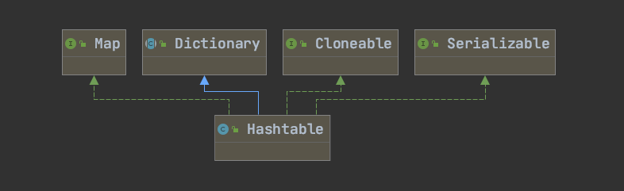

- 初始容量：11，负载因子.75

- 实现方式：数组加链表

- 扩容方式： `int newCapacity = (oldCapacity << 1) + 1;`

- 数组下标：`int index = (e.hash & 0x7FFFFFFF) % newCapacity;`

- hash冲突采用头插法

- 同步的实现机制


###有序Map
####  TreeMap
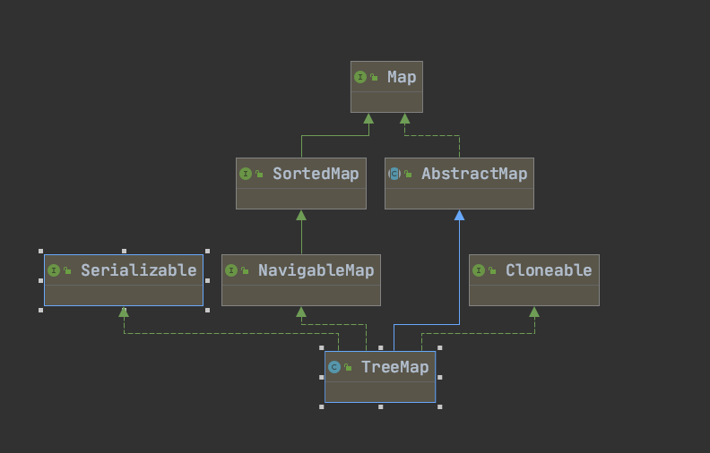
数据结构： 红黑树🌲
[参考资料](https://www.jianshu.com/p/2dcff3634326)

----- 
## Collection
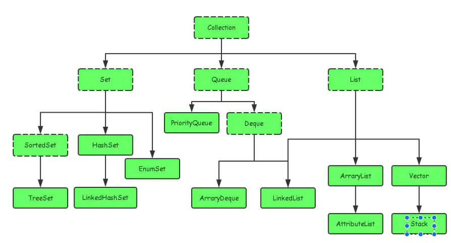
---
### List
#### Vector
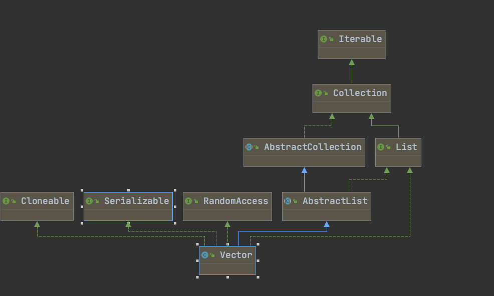

```java
数据结构为数组，数组扩容使用Arrays.copyOf(),初始容量为10，线程安全。
```
##### Stack
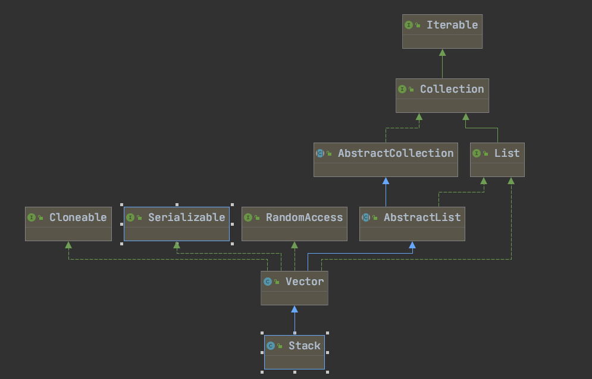

```java
继承自Vecter，添加了几个方法来实现栈的特性。
1. pop()，返回并移除元素，调用 System.arraycopy(elementData, index + 1, elementData, index, j); 实现元素去除。
2. peek(),返回元素但不移除
3. push(),在数组最后添加元素
```

#### ArrayList
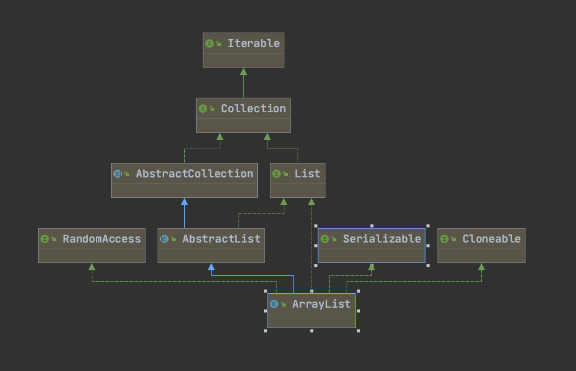

```java
数据结构为 Object 数组，初始容量为10
```
#### LinkedList
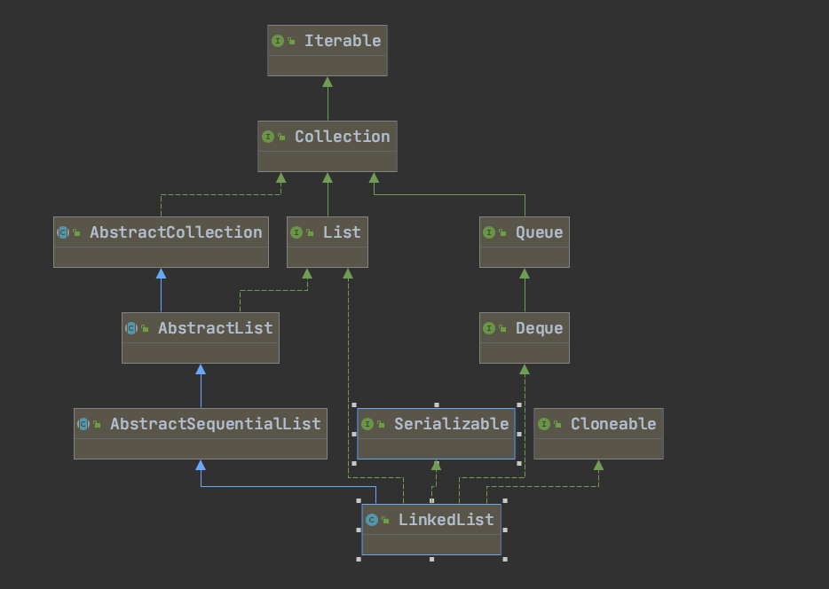

数据结构为：`由Node节点组成的双向链表`

-----
### Set
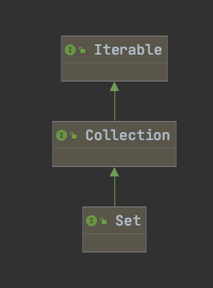
#### TreeSet

数据结构为`TreeMap`，保证了元素不重复，这里如果key相同，由于value也相同，所以元素不会重复。

```java
public boolean add(E e) {
        return m.put(e, PRESENT)==null;
    }
```

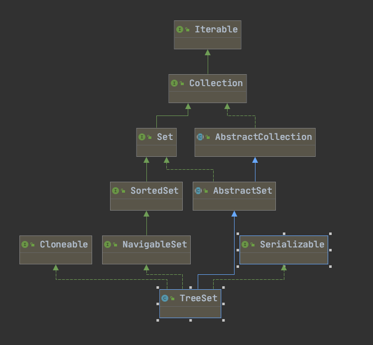
#### HashSet

数据结构为 `HashMap`,保重元素不会重复。
```java
 public boolean add(E e) {
        return map.put(e, PRESENT)==null;
    }
```
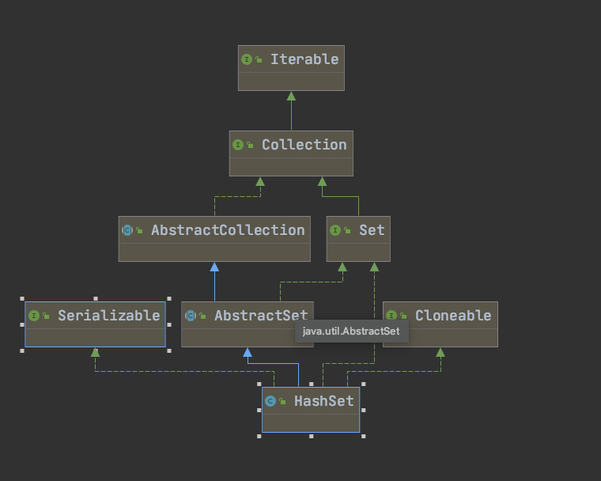
##### LinkedHashSet
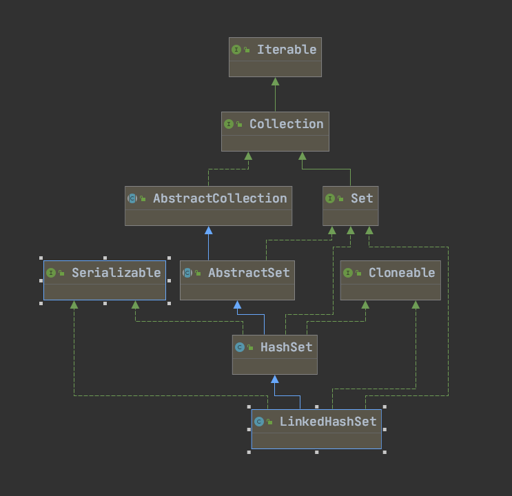

数据结构为：`LinkedHashMap`
-----
### Queue
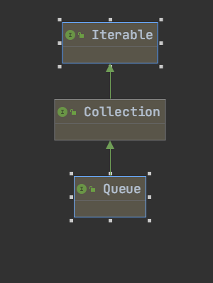
#### ConcurrentLinkedQueue
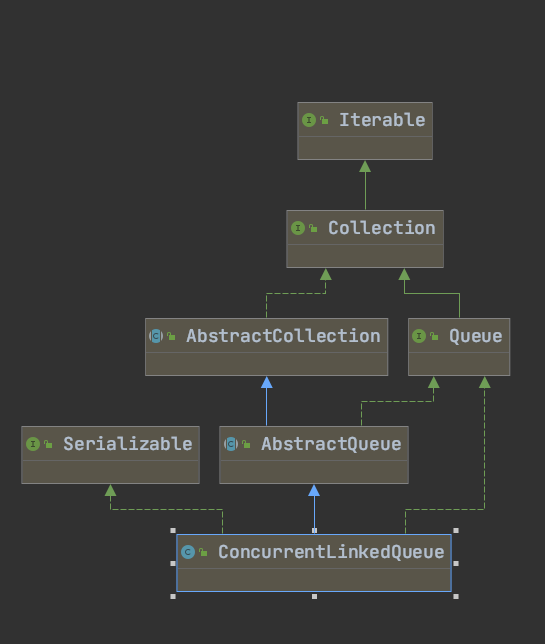
#### ArrayBlockingQueue
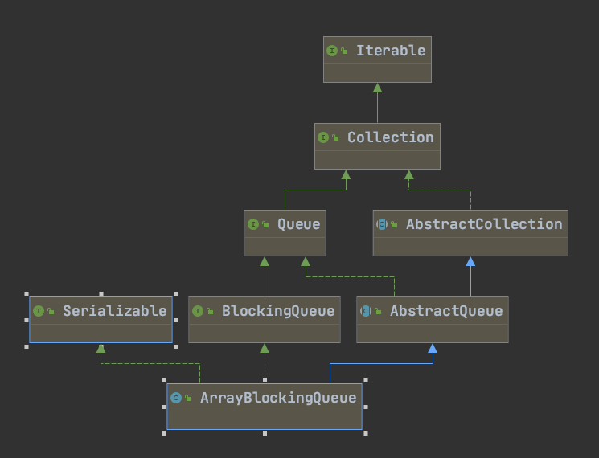
#### LinkedBlockingQueue
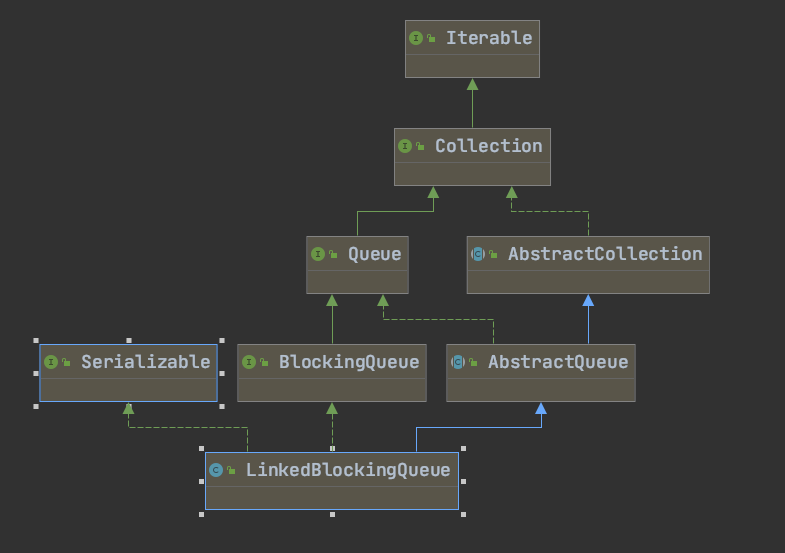

数据结构：`单向链表`,线程安全，使用RectangleLock实现,  `LinkedBlockingQueue可以同时有两个线程在两端执行操作`
#### LinkedBlockingDeque
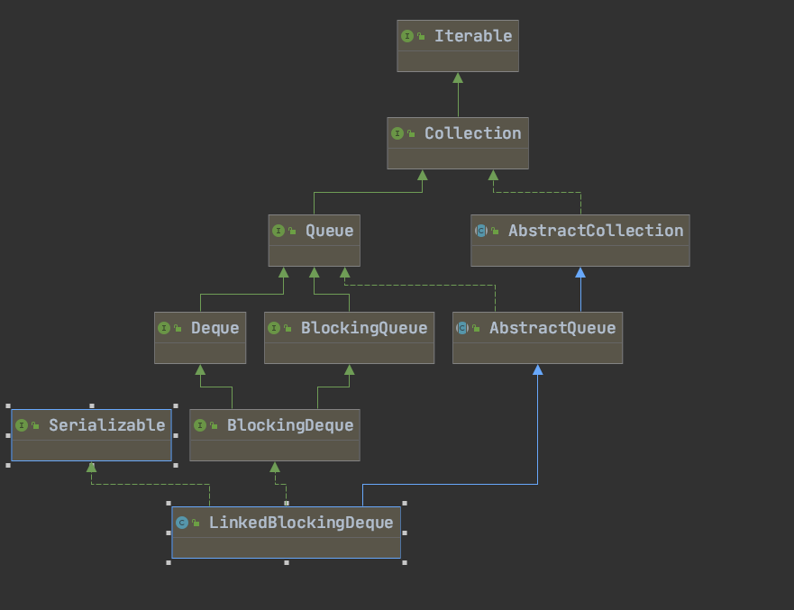

数据结构：`双向链表`,`同一时刻只有一个线程可以在队头或者队尾执行入队或出队操作`
