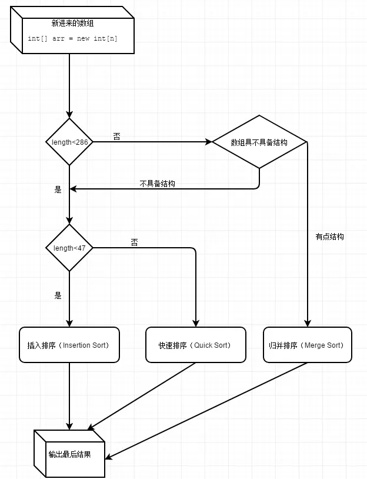

## 为什么要采用不同的算法？
- 对于长度较小的数组使用插入排序这很好理解，虽然插入排序的时间复杂度为O(n^2)，但在n较小的情况下，插入排序性能要高于快速排序。

- 其次我们要知道，在n的数量较大时，归并排序和快速排序，都是性能最优的排序算法，他们的时间复杂度平均都在O(nlogn)左右，只不过区别在于 [归并排序是稳定的，快速排序是不稳定的](https://baike.baidu.com/item/%E6%8E%92%E5%BA%8F%E7%AE%97%E6%B3%95%E7%A8%B3%E5%AE%9A%E6%80%A7/9763250)。

## 插入排序
```java
for(int i = left;j = i,i < right;j = ++i){
    // 取得后面的数字
    int ai = a[i+1];
    while(ai < a[j]){
        // 如果后面数字比前一个数字小就要移动数字并找到插入的位置
        a[j + 1] = a[j];
        if(j-- == left){
            break;
        }
    }
    // 给插入的位置赋值
    a[j+1] = ai;
}

```

## 快排 
[视频链接](https://www.youtube.com/watch?v=KUcByl1bVyg)
```java

void swap(int a[], int i, int j) {
        int tmp = a[i];
        a[i] = a[j];
        a[j] = tmp;
    }

void quickSort(int a[], int start, int end) {
        if (start >= end) {
            // 只剩下一个元素直接返回
            return;
        }
        int k = a[start];
        int i = start, j = end;
        while (i != j) {
            while (j > i && a[j] >= k) {
                // 后面的比基准值大，不动,j--,找到比k小的值
                --j;
            }
            // 交换k 和 比k小的值
            swap(a, i, j);
            while (i < j && a[i] <= k) {
                // 找到比k大的值，i++
                i++;
            }
            // 交换
            swap(a, i, j);
        }
        quickSort(a, start, i - 1);
        quickSort(a, i + 1, end);
}
```

### 拓展
1.[双轴快排](https://blog.csdn.net/Regino/article/details/104862546)
> 双轴快速排序与快速排序的主要的区别就是经典快速排序递归的时候把输入数组分成两段，而Dual-Pivot则分三段。

> 如果按照元素 比较次数 来比较的话，DualQuickSort 的元素比较次数其实比 QuickSort 要多；

>但是因为 DualQuickSort 比 QuickSort 节省了更多的元素扫描，从而节省了实际运算时间，故取代了 QuickSort 成为处理大量随机数据时的最佳方案。


## 归并排序
```java
    /**
     * @param a     待排序数组
     * @param start 开始位置
     * @param end   结束位置
     * @param tmp   临时变量，用于存放合并的数组
     */
void mergeSort(int[] a, int start, int end, int[] tmp) {
        // start 小于 end的时候才排序，等于表明只有一个值，不用二分
        if (start < end) {
            int mid = start + (end - start) / 2;
            mergeSort(a, start, mid, tmp);
            mergeSort(a, mid + 1, end, tmp);
            // 合并数组
            merge(a, start, mid, end, tmp);
        }

    }

void merge(int[] a, int start, int mid, int end, int tmp[]) {
        // 合并两个数组
        int pb = 0;
        int p1 = start, p2 = mid + 1;
        while (p1 <= mid && p2 <= end) {
            if (a[p1] < a[p2]) {
                tmp[pb++] = a[p1++];
            } else {
                tmp[pb++] = a[p2++];
            }
        }
        while (p1 <= mid) {
            tmp[pb++] = a[p1++];
        }
        while (p2 <= end) {
            tmp[pb++] = a[p2++];
        }
        
        // 将排好了顺序的数组写到a中
        for (int i = 0; i < end - start + 1; i++) {
            a[start + i] = tmp[i];
        }
    }

```


# Arrays.sort(int[])



# Collections.sort()
1. 底层调用的还是Arrays.sort()

2. 有Arrays.sort有插排、快排，归并排序等排序算法，对于Object[] 中，判断两个对象的大小使用的是`Comparable`的`compareTo`方法。