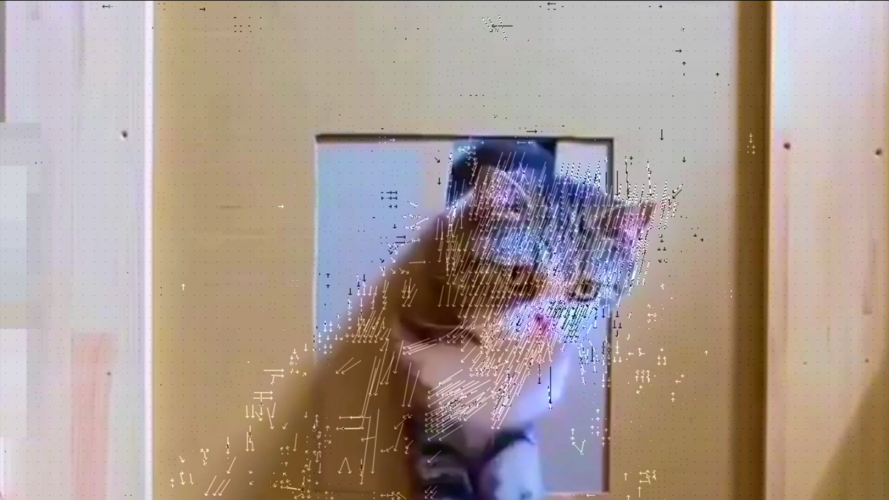

### AVFilter
`ffmpeg -i /Users/loyal888/Desktop/68d9fc8f789448698770213e9828a467.m204.mp4 -vf "split [main][tmp];[tmp]crop=iw:ih/2:0:0,vflip [flip];[main][flip]overlay=0:H/2" 1.mp4`


### 自定义只支持H.264、AAC与MP4封装格式
```java
./configure --disable-filters --disable-encoders --disable-decoders --disable-hwaccels --disable-muxers --disable-demuxers --disable-parsers --disable-bsfs --disable-protocols --disable-indevs --disable-devices  --enable-libx264 --enable-libfdk-aac --enable-gpl --enable-nonfree --enable-muxer=mp4”
```
# 常用命令
### “查看多媒体数据包信息”
```java
ffprobe -show_packets input.flv
```
### “查看多媒体封装格式”

```java
ffprobe -show_format  1.mp4
```

### “查看视频文件中的帧信息”
`ffprobe -show_frames  1.mp4`

### “查看视频文件中的流信息”
`ffprobe -show_frames  1.mp4`

### 视频信息JSON格式输出
`ffprobe -of json -show_packets  1.mp4`

### ffplay 使用运动估计
` ffplay -flags2 +export_mvs -ss 2 /Users/loyal888/Desktop/68d9fc8f789448698770213e9828a467.m204.mp4 -vf codecview=mv=pf+bf+bb`
> 运动估计
>
> 

---

# mp4生成m3u8
`ffmpeg -re -i /Users/loyal888/Desktop/test.mp4 -c copy -f hls -bsf:v h264_mp4toannexb -start_number 100  test.m3u8`

# m3u8 设置HLS分片大小
`ffmpeg -re -i /Users/loyal888/Desktop/test.mp4 -c copy -f hls -bsf:v h264_mp4toannexb -start_number 100 -hls_time 0.5  test.m3u8`

# m3u8最大分片

`ffmpeg -re -i /Users/loyal888/Desktop/test.mp4 -c copy -f hls -bsf:v h264_mp4toannexb -hls_list_size 2  test.m3u8ffmpeg`

#  hls_base_url 指定文件路径

----

# FFMPEG RTMP直播推流
`ffmpeg  -i 1.mp4 -c:v libx264  -f flv -rtmp_app myapp -rtmp_playpath room  rtmp://rtmp.test.com`

# FFPLAY RTMP 直播拉流
`ffplay rtmp://rtmp.test.com/myapp/room`

# FFPLAY HTTP-FLV 拉流
`ffplay -i 'http://10.252.220.220/live?app=myapp&stream=room'`

# FFMPEG 录制
`ffmpeg -i rtmp://rtmp.test.com/tv_file/room -c copy -f flv outpot.flv`

# HTTP直播拉流防止盗链
使用-herders 加入referer参数
`ffmpeg -headers "referer:https://test.com"  -i http://test//live/yzS71335083855220113408.flv -c copy -y output.mp4`

# TCP 监听接受流
`ffmpeg -listen 1 -f flv -i tcp://127.0.0.1:1234/live/stream -c copy -f flv 111.flv`
** 必须先监听才能推流 **

# TCP推流
`ffmpeg -re -i 1.mp4 -c libx264 -f flv tcp:127.0.0.1:1234/live/stream`

# FFMPEG 推多路流
`ffmpeg  -i 1.mp4 -c libx264 -f flv - | ffmpeg -f flv -i - -c libx264  -f flv tcp://127.0.0.1:1234/live/stream -c libx264 -f flv -rtmp_app myapp -rtmp_playpath room  rtmp://rtmp.test.com`

# FFMPEG 滤镜使用
## 使用filter添加水印
`ffmpeg -i 1.mp4 -i 直播.png -filter_complex "[1:v]scale=100:100[logo];[0:v][logo]overlay=x=0:y=0" -t 5 overlay.mp4`

将 直播.png 指定为100*100大小的图片合成在视频左上角位置处

## 使用movie滤镜添加图片水印：

```java
ffmpeg -i 1.mp4 -vf "movie=直播.png[wm];[in][wm]overlay=30:10[out]" out.mp4
```

## 画中画

```java
ffmpeg -i 1.mp4 -vf "movie=out.mp4,scale=200x200[test];[in][test]overlay=x=200:y=200 [out]" -vcodec libx264 test.flv
```

## 四宫格排列
```java
ffmpeg -re -i 1.mp4 -re -i 1.mp4 -re -i 1.mp4 -re -i 1.mp4 -filter_complex "nullsrc=size=640x480 [base]; [0:v] setpts=PTS-STARTPTS, scale=320x240 [upperleft]; [1:v] setpts=PTS-STARTPTS, scale=320x240 [upperright]; [2:v] setpts=PTS-STARTPTS, scale=320x240 [lowerleft]; [3:v] setpts=PTS-STARTPTS, scale=320x240 [lowerright]; [base][upperleft] overlay=shortest=1 [tmp1]; [tmp1][upperright] overlay=shortest=1:x=320 [tmp2]; [tmp2][lowerleft] overlay=shortest=1:y=240 [tmp3]; [tmp3][lowerright] overlay=shortest=1:x=320:y=240" -c:v libx264 output.flv
```


# FFMPEG 音量探测
## 获取音频相关信息
```java
ffmpeg -i 1.aac -filter_complex volumedetect -c:v copy -f null /dev/null
```


## 音频波形绘制
```java
ffmpeg -i 1.aac -filter_complex "showwavespic=s=640x120" -frames:v 1 1.png
```


## FFMPEG 视频抽帧
```java
ffmpeg -i 1.mp4 -ss 00:00:1.234 -vframes 1 out.png
```

## FFMPEG 截取关键帧
```java
ffmpeg -i 1.mp4  -vf "select='eq(pict_type,PICT_TYPE_I)'" -vsync vfr thumb%04d.png
```

## FFMPEG 录制桌面屏幕
```java
ffmpeg -f avfoundation -i "Capture screen 0" -r:v 30 -t 5 out.mp4
```

## MOOV前置
`ffmpeg -i out.mp4 -movflags faststart out1.mp4`

