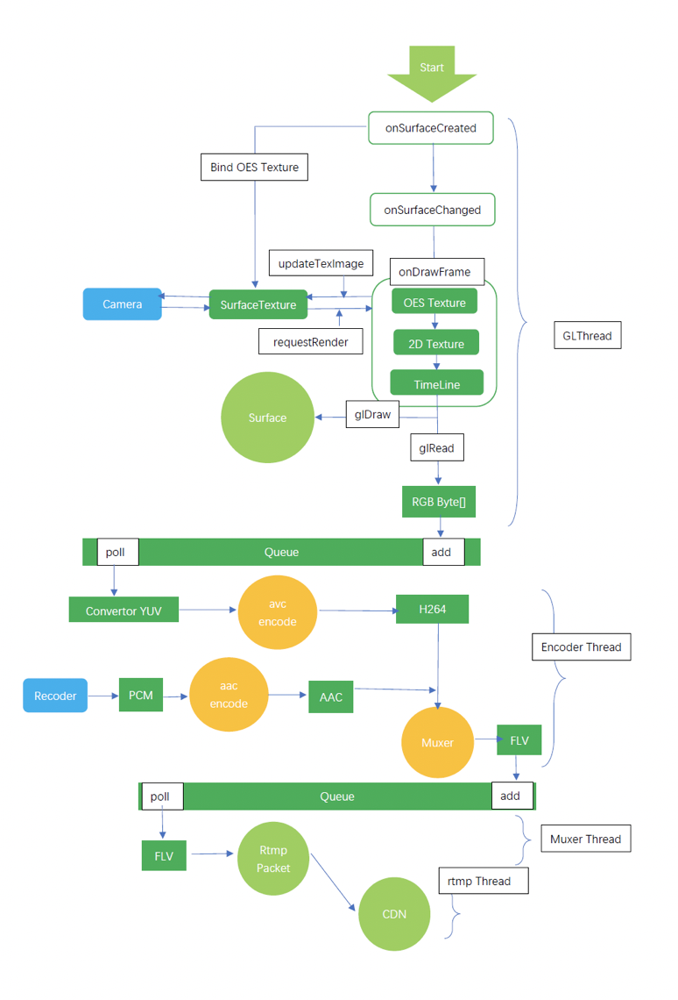
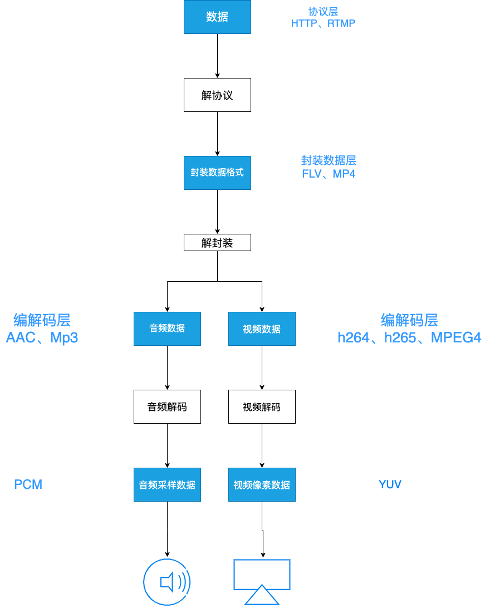
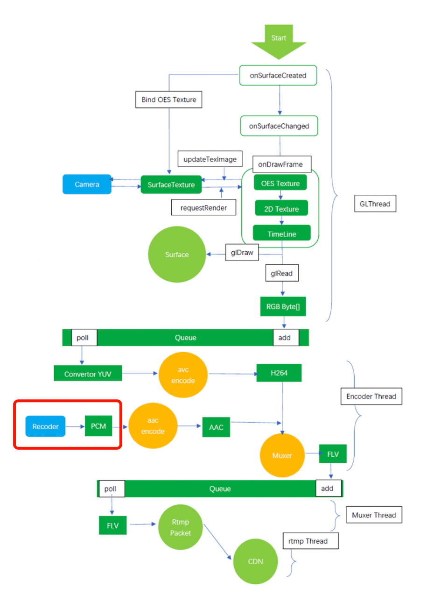
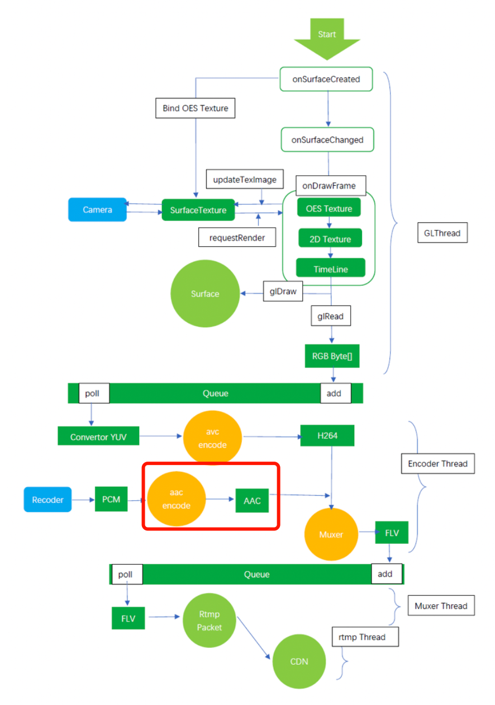
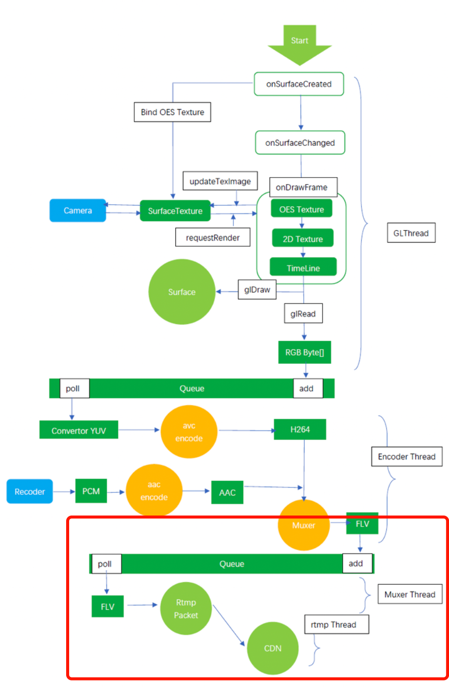

### 视频封装格式有哪些？
---

一个完整的视频文件，包括音频、视频和基础元信息，我们常见的视频文件如mp4、mov、flv、avi、rmvb等视频文件，就是一个容器的封装，里面包含了音频和视频两部分，并且都是通过一些特定的编码算法，进行编码压缩过后的。

例如：将一个Xvid视频编码文件和一个MP3音频编码文件按AVI封装标准封装以后，就得到一个AVI后缀的视频文件。

### 音频编码格式

#### 音频编码格式有如下:

- AAC
- AMR
- PCM
- ogg(ogg vorbis音频)
- AC3(DVD 专用音频编码)
- DTS(DVD 专用音频编码)
- APE(monkey’s 音频)
- AU(sun 格式)
- WMA

音频编码方案之间音质比较（AAC，MP3，WMA等）结果： 

AAC+ > MP3PRO > AAC> RealAudio > WMA > MP3
目前最常见的音频格式有 Mp3、AC-3、ACC，MP3最广泛的支持最多，AC-3是杜比公司的技术，ACC是MPEG-4中的音频标准，ACC是目前比较先进和具有优势的技术。对应入门，知道有这几种最常见的音频格式足以。

## 视频编码格式

视频编码标准有两大系统：

- “国际电联（ITU-T）”，它制定的标准有H.261、H.263、H.263+、H.264等，
- “国际标准化组织（ISO）”它制定的标准有MPEG-1、MPEG-2、MPEG-4等。

#### 常见编码格式有：

- Xvid(MPEG4)

- H265

- H264 

- H263

- MPEG1，MPEG2

- AC-1

- RM，RMVB

    

目前最常见的视频编码方式的大致性能排序基本是：

 MPEG-1/-2 < WMV/7/8 < RM/RMVB < Xvid/Divx < AVC/H.264 < H.265（由低到高，可能不完全准确）。

在H.265出来之前，H264是压缩率最高的视频压缩格式，其优势有:

- 低码率（Low Bit Rate）：和MPEG2和MPEG4 ASP等压缩技术相比，在同等图像质量下，采用H.264技术压缩后的数据量只有MPEG2的1/8，MPEG4的1/3。
- 高质量的图象 ：H.264能提供连续、流畅的高质量图象（DVD质量）。
- 容错能力强   ：H.264提供了解决在不稳定网络环境下容易发生的丢包等错误的必要工具。
- 网络适应性强 ：H.264提供了网络抽象层（Network Abstraction Layer），使得H.264的文件能容易地在不同网络上传输（例如互联网，CDMA，GPRS，WCDMA，CDMA2000等）。

## 存储封装格式
目前市面常见的存储封装格式有如下：

- AVI (.avi)
- ASF（.asf)
- WMV (.wmv)
- QuickTime ( .mov)
- MPEG (.mpg / .mpeg)
- MP4 (.mp4)
- m2ts （.m2ts / .mts )
- Matroska （.mkv / .mks / .mka )
- RM ( .rm / .rmvb)
- TS/PS
- FLV

为什么把flv叫做流式文件格式？ 和mp4，avi不是一样都是音视频的容器吗？ 有什么区别？

通常说的流式文件是可以边传边解的，开始不需要整个文件。特点是有文件头信息（这个不是必需的）和中间打包了，可以直接解析分包，而且文件可以任意大小，而不需要通过索引分包。FLV，MPEG，RMVB等都可以直接依次分包解析，而MP4，AVI一定要依赖索引表才行，而且开始就要固定位置好，如果索引表在尾部，还没办法解析。

流媒体文件是指多媒体文件边下载可以边观看的文件。而传统的视频文件需下载完成才能观看，而流媒体主要是下载一部分文件到缓存区，然后再从缓存区里面拿数据~而能作为这种流媒体文件的只有经过特殊编码的格式才适合，而flv、rmvb、mov、asf等格式文件才属于流媒体格式文件

对于相同的音视频内容，使用三种不同的封装格式，则文件体积从大到小依次为：  TS -> MP4 -> FLV

 FLV和MP4封装格式的文件大小基本相等。

----

# 视频推流流程分析
### <font color="#f66d04">直播架构图</font>


手机端通过RTMP协议将音视频流推送到源server，server通过分发到cdn上，播放时访问cdn节点，拉取直播数据进行播放。

更详细的架构图



**拉取直播流播放一般要经历如下图几个过程。**



那么我们今天要讲的推流过程就是上面的逆过程。

# <font color="#f66d04">音频的采集</font>
音频采集就是下面这一部分工作。



我们已经知道，音频的裸数据格式是PCM数据。在 Android 系统中，一般使用 `AudioRecord` 或者 `MediaRecord` 来采集音频。

`AudioRecord `是一个比较偏底层的API,它可以获取到一帧帧 `PCM 数据`，之后可以对这些数据进行处理。

而 `MediaRecorder `是基于 AudioRecorder 的 API(最终还是会创建AudioRecord用来与AudioFlinger进行交互) ，它可以直接将采集到的音频数据转化为执行的编码格式，并保存。

直播中采用的就是 `AudioRecorder` 采集音频数据。接下来就看下如何使用AudioRecorder初始化数据。

### <font color="#f66d04">1.AudioRecorder的初始化</font>
```java
//  Returns the minimum buffer size required for the successful creation of an AudioRecord object, in byte units.
bufferSizeInBytes = AudioRecord.getMinBufferSize(
                44100,
                AudioFormat.CHANNEL_IN_STEREO,
                AudioFormat.ENCODING_PCM_16BIT);
// 构造AudioRecord
audioRecord = new AudioRecord(MediaRecorder.AudioSource.MIC,
                44100,
                AudioFormat.CHANNEL_IN_STEREO,
                AudioFormat.ENCODING_PCM_16BIT,
                bufferSizeInBytes
        );
```
### <font color="#f66d04">2. 开启一个线程来录制音频</font>
```java
/**
     * 开启一个线程来录制音频
     */
    public void startRecord() {
        new Thread() {
            @Override
            public void run() {
                super.run();
                start = true;
                // 开启录制
                audioRecord.startRecording();
                byte[] audiodata = new byte[bufferSizeInBytes];
                short[] audiodata = new byte[bufferSizeInBytes];
                while (start) {
                    // audioRecord.read方法就可以获取到PCM数据了
                    readSize = audioRecord.read(audiodata, 0, bufferSizeInBytes);
                    if (onRecordLisener != null) {
                        // 读取到音频字节数组，回调给调用中心
                        onRecordLisener.recordByte(audiodata, readSize);
                    }
                }
                if (audioRecord != null) {
                    audioRecord.stop();
                    audioRecord.release();
                    audioRecord = null;
                }
            }
        }.start();
    }
```

通过` onRecordLisener.recordByte(audiodata, readSize);` 将数据传给了调用方，那么这个调用方是谁？拿到的数据去哪了？（那天我回到家，哎，爸爸去哪儿了.jpg）

```java

audioRecordUitl.setOnRecordLisener(new AudioRecordUitl.OnRecordLisener() {
            @Override
            public void recordByte(byte[] audioData, int readSize) {
                // 音频数据线程回调
                if (audioRecordUitl != null && audioRecordUitl.isStart()) {
                
                    // 连接成功后才会创建 pushRtmpEncoder 去编码
                    if (pushRtmpEncoder != null) {
                        pushRtmpEncoder.putPCMData(audioData, readSize);
                    }
                }
            }
        });
```
原来是交给后面的流程，编码器去编码去了啊！（爸爸找到了.jpg）
# <font color="#f66d04">音频编码</font>



[1.先了解下MediaCodec是什么？]()

[MediaCodec](https://developer.android.com/reference/android/media/MediaCodec)

[2.看一下putPCMData做了什么？]()

```java
 public void putPCMData(byte[] buffer, int size) {
        try {
            if (audioEncodecThread != null && !audioEncodecThread.isExit && buffer != null && size > 0) {
                // 1. 取出inputBufferindex，去出一个桶来装数据
                int inputBufferindex = audioEncodec.dequeueInputBuffer(0);
                if (inputBufferindex >= 0) {
                    ByteBuffer byteBuffer = audioEncodec.getInputBuffers()[inputBufferindex];
                    byteBuffer.clear();
                    byteBuffer.put(buffer);
                    // 2. 设置音频的显示时间戳
                    long pts = getAudioPts(size, sampleRate);
                    // 3. 将数据放入队列中，queueInputBuffer,之后MediaCodec将进行编码
                    audioEncodec.queueInputBuffer(inputBufferindex, 0, size, pts, 0);
                }
                synchronized (audioLock) {
                    // 4.放了数据后，通知编码线程，桶中有数据了
                    audioLock.notifyAll();
                }
            }
        } catch (Exception e) {
            synchronized (audioLock) {
                audioLock.notifyAll();
            }
        }
    }
```

队列中有数据之后，很明显我们就可以取出这个编码好的aac数据进行封装了。

```java
// 根据上面的桶index，拿出数据
ByteBuffer outputBuffer = audioEncodec.getOutputBuffers()[outputBufferIndex];

if (encoder != null && encoder.get() != null && encoder.get().onMediaInfoListener != null) {
    // 取出数据的数据就是编码好的AAC数据了
     encoder.get().onMediaInfoListener.onAudioInfo(data);
 }
```

视频数据的生成，原理也差不多是这几步，只不过输入的数据换成了YUV数据。（其实是OPENGL从入门到放弃...还是挑软柿子捏得劲儿），视频编码封装过程可以结合流程图理解下。

音视频数据生成了，那我们应该将数据包装成RTMP格式的数据进行发送了。

# <font color="#f66d04">音视频发送</font>

```c++
/**
 * 将音频数据压入队列
 * @param data 音频数据
 * @param data_len 数据长度
 */
void RtmpPush::pushAudioData(char *data, int data_len) {
    int bodysize = data_len + 2;
    RTMPPacket *packet = static_cast<RTMPPacket *>(malloc(sizeof(RTMPPacket)));
    RTMPPacket_Alloc(packet, bodysize);
    RTMPPacket_Reset(packet);
    char *body = packet->m_body;
    // HE-AAC 44 kHz 16 bit stereo
    body[0] = 0xAF;
    body[1] = 0x01;
    memcpy(&body[2], data, data_len);
    // 下面RTMP 头信息
    // Message type ID
    packet->m_packetType = RTMP_PACKET_TYPE_AUDIO;
    // 消息长度
    packet->m_nBodySize = bodysize;
    // 时间戳
    packet->m_nTimeStamp = RTMP_GetTime() - startTime;
    packet->m_hasAbsTimestamp = 0;
    // 块流ID
    packet->m_nChannel = 0x04;
    packet->m_headerType = RTMP_PACKET_SIZE_LARGE;
    // 消息流ID
    packet->m_nInfoField2 = rtmp->m_stream_id;
    queue->putRtmpPacket(packet);
}

```

接下来将RTMP数据通过网络发送给server。

# <font color="#f66d04">视频封装</font>

由于我们这里是直播，封装过程可以交给Server去做，封装好后就可以拉流下来播放了。

