# 6.4 - 视频画面的编码
学习记录：
## libx264 编码H264
1.**编码器的接口定义** 
> 硬解码和软解码的通用接口
> 通用接口如下：
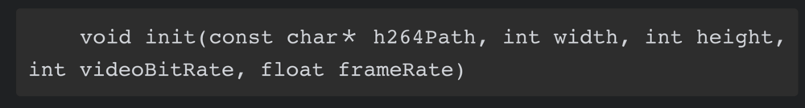

2.创建编码器的接口
> 虚方法，子类实现，具体看是硬编码还是软编码，**负责创建编码器资源**以及**转化纹理对象**以适配适配器
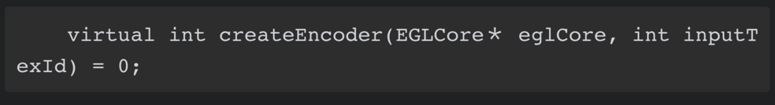
>> 注释：有两钟适配器，SoftEncoderAdapter 和 HWEncoder

3.创建编码接口

> 子类来实现编码操作，即利用自己构造的OpenGl ES渲染线程来完成适配工作

4.销毁编码器接口
> 销毁编码器及渲染线程
> 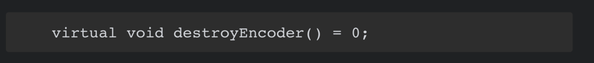

5.总体结构
>

6.SoftEncoderAdapter
>整体结构
>
>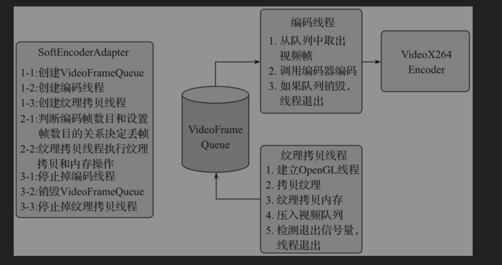

7.VideoFrameQueue
> 1.init() 初始化锁保证线程安全
>
> 2.put() 将VideoFrame链接到Queue中，发出signal指令
>
> 3.get() 去除元素，没有就wait，等手动signal再取元素。取到元素怎么办呢？调用编码线程encode方法编码
>
> 4.abort() 释放所有元素

8.编码线程
> 1. 初始化编码器
> 2. 取出videoFrame并encode
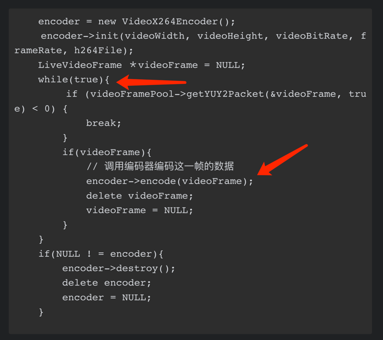

9.纹理拷贝线程
> 1. 初始化OpenGL ES 上下文环境，绑定到新建立的纹理拷贝线程，这样新建立的上下文就可以和已存在的EGLContext 共享上下文的所有共享对象。
> 2. 创建输出纹理ID、帧缓存对象（将输入纹理的内容绘制到输出纹理上面）
> 3. 输出纹理id的内容从显存拷贝到内存
>> 3.1 减少数据两的读取，RGBA -> YUY2
> 4. 将YUY2交给编码器编码

10.VideoX264Encoder
> 1. init()  负责初始化编码器上下文及编码之前的AVFrame
> 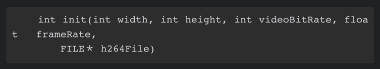

> 2.encode()
>
> 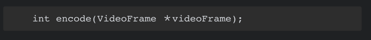
>> VideoFrame 包含来这一帧图片YUY2数据及时间信息
>>
>> 2.1 将YUY2数据格式转换为YUV420P
>>
>> 2.2 将这幅图像编码成H264，并写入文件

> 3.destroy（）
>
> 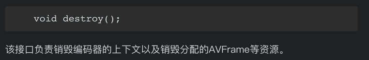
## MediaCodec 硬件编码
> 1. 调用java层方法，创建编码器
> 2. 编码器配置成功后，创建MediaCodec的输入Surface
> 3. 调用encoder.start()开始编码器
> 4. 将Java层调用的Surface对象传递给Native层，然后创建ANativeWindow,创建EGLSurface，创建render（利用这个render将输入纹理id渲染到目标Surface上去）
> 5. 创建jbyteArray类型的buffer，用于保存MediaCodec拉去编码之的H264数据
> 6. 创建线程来拉取编码器的编码数据，自线程等待Message
> 7. 主线程调用encode()方法，过滤帧数，到达一定帧才去填充数据，发送填充数据Message
> 8. 将jbyteArray传递给java层，填充数据
> 9. 将jbyteArray区分SPS和PPS、普通帧写入到文件中

# 2020.9.13
## 开发视频录制应用学习记录
仓库地址：https://github.com/loyal888/Android-as_video_recorder
### 视频录制的架构
1.音频架构
> 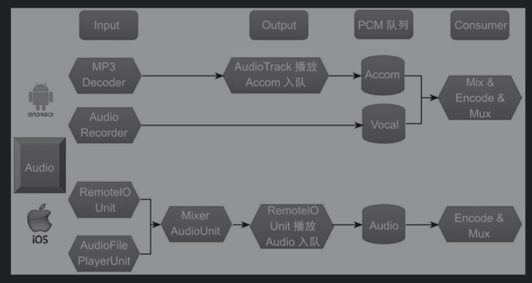
>
>**输入模块**:两个输入源,麦克风输入（AudioRecorder） & 用户背景音乐输入(Mp3Decoder)
> 
>**输出模块**：AudioTrack播放
>
>**PCM队列**：Accom & Vocal，保存背景音乐和用户声音到队列
>
>**Consumer**：取出后pcm数据，进行音频aac的编码，封装到mp4文件中
>
2.视频架构
>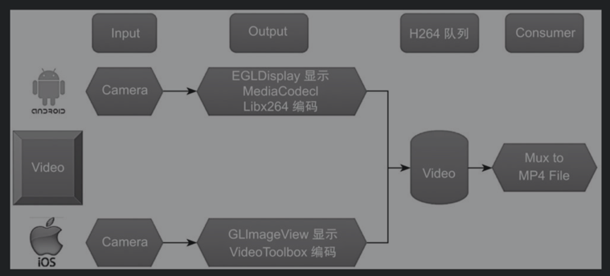
>
>**输入模块**：Camera
>
>**输出模块**：预览，EDL+OpenGL+SurfaceView；编码，优先使用硬件编码（MediaCodec），兼容性问题才用软件编码（libx264）。
>
>**H264队列**：存储H264数据包
>
>**Consumer**：取出H264数据包，利用FFMPEG的Mux模块封装到mp4视频音轨中
>
>**那么可不可以说mp4文件由：H264数据包 + aac音轨组成？？**

### 音频模块的实现
1.音频队列
定义AudioPacket，用于存放采集到的PCM音频数据
```c++
typedef struct LiveAudioPacket {
	short * buffer;
	byte* data;
	int size;
	float position;
	long frameNum;

	LiveAudioPacket() {
		buffer = NULL;
		data = NULL;
		size = 0;
		position = -1;
	}
	~LiveAudioPacket() {
		if (NULL != buffer) {
			delete[] buffer;
			buffer = NULL;
		}
		if (NULL != data) {
			delete[] data;
			data = NULL;
		}
	}
} LiveAudioPacket;
```
2.定义一个BlockQueue用于存放AudioPacket,链表实现
作用：生产者AudioRecorder将音频数据存入这里，消费者（AudioTrack）就可以拿到PCM数据播放

**伴奏的解码与播放**

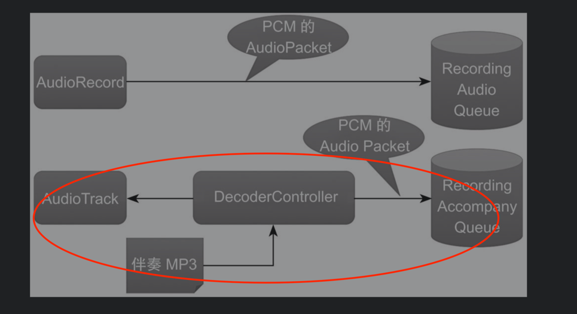

3.初始化解码队列（桥梁，连接解码线程和播放器）

4.初始化伴奏音频队列(桥梁，连接播放器和编码线程)

5.将伴奏AudioPacket数据复制到伴奏音频队列中

**AudioRecord音频入队**


6.将AudioRecod采集的音频文件写到PCM队列中去
# 7.3 音频编码模块的实现
> 1. 维护一个编码线程，不断从音频队列中取出PCM数据
>
> 2. 然后调用encode编码器，使其成为AAC数据
>
> 3. 将AAC数据封装成为AudioPacket
>
> 4.将AudioPacket放入到AAC队列中。
>
# 7.4 画面采集与编码模块到实现

# 7.5 Mux模块
**负责将视频帧和音频帧封装到MP4文件中**

## 7.5.1 如何视同FFMPEG实现格式封装与文件流输出？
`libavformat`

**初始化**
> - **初始化参数:** 包括文件输出路径、视频流参数、音频流参数
```c++
int RecordingPublisher::init(char *videoOutputURI,
                             int videoWidth, int videoHeight, float videoFrameRate,
                             int videoBitRate,
                             int audioSampleRate, int audioChannels, int audioBitRate,
                             char *audio_codec_name,
                             PublisherStatistics *statistics,
                             int qualityStrategy,
							 const std::map<std::string, int>& configMap) {
```
>
> - 构造一个Container（AVFormatContext）,根据视频参数配置好音频流（AVStream）并添加到Container中，添加一个视频流（AVStream）并添加到Container中
>> - 添加音频流之后，需要为编码器上下文设置一下`extradata`变量，便于为解码器提供原始数据，从而初始化解码器。
>> - 配置一个音频转换器的滤波器，即`ADTS` -> `ASC` 格式的滤波器
> - 打开文件的连接通道
```c++
AVIOInterruptCB int_cb = {interrupt_cb, this};
            oc->interrupt_callback = int_cb;
            ret = avio_open2(&oc->pb, videoOutputURI, AVIO_FLAG_WRITE, &oc->interrupt_callback,
                             NULL);
            if (ret < 0) {
                LOGI("Could not open '%s': %s\n", videoOutputURI, av_err2str(ret));
                return -1;
            }
            this->isConnected = true;
```
>
**封装**

不断将音频帧和视频帧**交错**封装进来，然后通过输出通道写出到文件或网络中。

- 封装音频流
> 从**音频队列**中取出一帧音频帧
>
> 取出音频帧时间戳信息，存储在全局变量中，方便交错封装
>
> 将AAC封装的Packet转换成AvPacket类型的结构体
>
> ADTS的AAC -> MEPEG4的AAC
>
> 将编码后的packet数据写入文件

- 视频的封装
> 填充视频编器上下文的`extradata`，以便解码器能够职场初始化解码视频
>
>> **如何填充`extradata`？**
>> 判断是否是SPS信息?
>>> 是:将这一帧H264数据拆分成SPS和PPS信息.将spsFrame和ppsFrame封装到`extradata`
>>>
>>> 否：封装输出视频帧。将H264数据封装成**AVPacket**。还有判断当前帧是否是关键帧，是的话将`flags`设置为0，解码器是按照是否是关键帧来构造解码过程中的参考队列。
>> 
> 取出H264队列中的视频帧，取出时间戳更新全局变量。
>
>
- 销毁资源
> 略。

>

# 7.6 中控系统串联器各个模块
控制器，串联起所有模块。
> 初始化H264视频队列和PCM音频队列
>
> 初始化Mux模块
>
> 初始化编码模块
>
> 启动音频的采集及编码
>
> 启动视频采集及编码

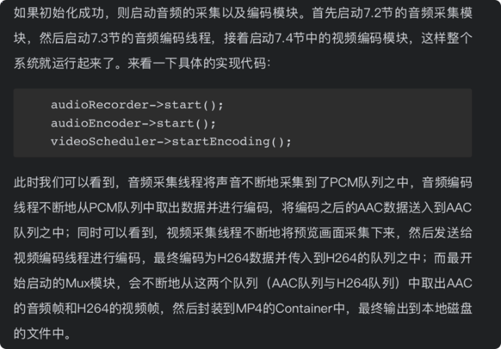

# 8.1 数字音频基础
## 波形图
波形图是随着时间推移而强度变化的曲线，即**时域表示**

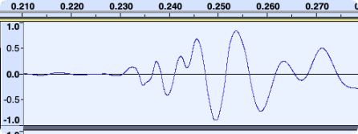

## 频谱图
傅立叶快速变换（`FFT`）:可以将型号转换为频域信号


> - 很多在时域看似不可能做到的数学操作，在频域相反很容易。这就是需要傅里叶变换的地方。尤其是从某条曲线中去除一些特定的频率成分，这在工程上称为`滤波`，是信号处理最重要的概念之一，只有在频域才能轻松的做到。
>
**时域和频域**详解：
> 频谱图
> 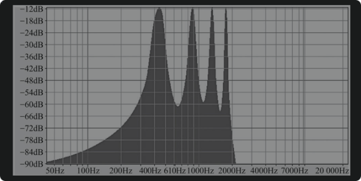
>

# 8.2 数字音频处理：快速傅立叶变换
**MayerFFT** & **Ne10**

MayerFFT： 时域信号转换为频域信号

# 8.3 基本乐理知识

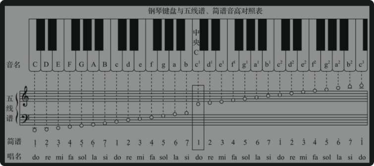

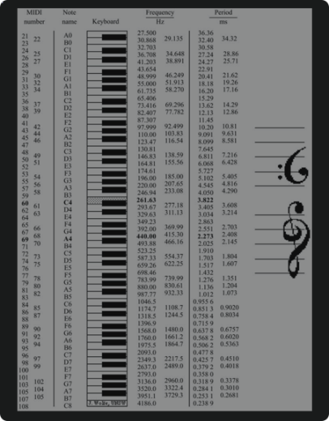

# 8.4 混音效果器

## 8.4.1 均衡效果器
- 效果器之间的区别在于：`声音在不同频段的提升或衰减`。可以调整音色。通俗的理解就是`声卡`。
- 声音的频率分布：

|名称|范围|几个八度|代表|
| - | - | - | - |
|超低频|1~20HZ|4个八度|地震，人耳听不到|
|非常低频|20~40Hz|1个八度|风声、雷声|
|低频|40~160Hz|2个八度|男低音部分|
|低中频|160~315Hz|1个八度|男中音、长笛|
|中频|315——2500Hz|3个八度|电话听筒|
|中高频|2500~500Hz|1个八度|公共喇叭|
|高频|500~10000Hz|1个八度|唇齿音|
|超高频|10KHz~20KHz|1个八度|人耳难以辨别|

---
均衡器：用来修正声音。
> **参数**：
>
> - 频段：以一个频率中心点左右扩充一定频率，形成频段，可以用bandWidth（频宽）来表示。
>
> - 频宽的单位通常为O（Octave），代表一个音程（八度）
>
> - 中心频率、频宽、增益

压缩效果器：在时域上对声音强度进行处理，当音频音量剧增时，自动将音量调小。

相关概念：门限值（Threshold）、整体增益（Unity Gain）、压缩比、作用时间（Attack Time）、释放时间（Release Time）

## 8.4.3 混响效果器
多个IR的叠加。

相关参数：空间大小（Room Size）、余响大小（Reverbrance）、阻尼控制（Damping）、干湿比（Dry Wat Mix Ratio)、立体声宽度（Stereo Width）

# 8.5 效果器的实现
sox:交叉编译出静态库文件
> SoX is a cross-platform (Windows, Linux, MacOS X, etc.) command line utility that can convert various formats of computer audio files in to other formats. It can also apply various effects to these sound files, and, as an added bonus, SoX can play and record audio files on most platforms.

# 9 视频效果器
## 9.1 图像处理的基本原理
图像的基本属性：
>亮度（灰度）：YUV分量中的Y分量
>
>对比度（contrast）：画面黑与拜的比值
>
>饱和度（saturation）：色彩的鲜艳程度

### 9.1.1 亮度调节
亮度调节分为**非线性亮度调节**和**线性亮度调节**


非线性亮度调节：对于图像的RGB通道。每个通道都增加相同的增量。
- 优点：代码简单，亮度调整速度快；
- 缺点：图像信息损失比较大，图像平淡，无层次感

线性亮度调节：将RGB图像转换为HSL的颜色空间，对L通道进行调节，得到新的L值，再与HS通道合并为新的HSL，最终转换为新的RGB。
> HSL：H（色相 Hue；饱和度 Saturation；明度 Lightness）
- 优点：层次感强
- 缺点：代码复杂，调节速度慢；亮度增加较大时图像失真严重

### 9.1.2 对比度调节
对比度的调整要对：RGB**同时**调整。不能分别调整，分别调整会造成色偏的问题。
**增加对比度的结果就是：色彩更丰富**
调整函数：`y = (x - 0.5)*contrast  + 0.5`

### 饱和度调节
i. 非线性调节
> 每个像素的RGB判断是否大于128，大于加上调节值，小于减去调节值
>
> - 先计算出亮度值：`luminance = 0，2125 * R + 0.7145 * G + 0.0721 * B`
> 
> - 然后计算出饱和度
> 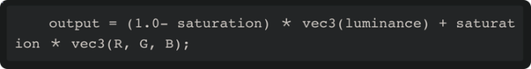

ii. 线性调节
> 将RGB转换为HSV，调整S部分。

## 9.2 图像处理进阶
[图像卷积](https://blog.csdn.net/chaipp0607/article/details/72236892)


### 9.2.2 锐化效果器
- 图像的锐化：补偿图像的轮廓，增强图像的边缘及灰度跳变的部分，使图像更加**清晰**

- 图像为什么会模糊：高频部分的能量被衰减，用户看到的是图像中的边界、轮廓变得模糊。如何扭转呢？使用：**对比度效果器、去块滤波器、锐化效果器。**

- 动态调解锐化程度的矩阵：`int matrix[3][3] = {
                                    0,-k,0,
                                    -k,4k+1,
                                    -k,0,-k,0
                                    }`
### 9.2.3 [高斯模糊算法](http://www.ruanyifeng.com/blog/2012/11/gaussian_blur.html)                                  

### 9.2.4 [双边滤波算法](https://blog.csdn.net/Jfuck/article/details/8932978)
原理为一个与空间距离相关的高斯函数与一个灰度距离相关的高斯函数相乘。


### 9.2.5 图层混合

## 9.3 FFMPEG 内部的视频滤镜
### 9.3.1 视频处理的时机
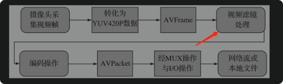

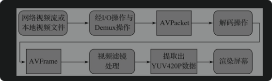

- 滤镜图的构建

- 使用和销毁滤镜图

## 9.4 使用OpenGL ES实现视频滤镜
### 9.4.1  添加水印
- 使用libpng将水印图片载入，然后将原始视频画到一个FBO上，最后将水印图片画到相应的位置上去。
-  **注意图片的变换**

### 9.4.2 添加自定义文字
- 将文字绘制到一个Bitmap上，然后将Bitmap传递给OpenGL ES处理与渲染

### 9.4.3 美颜效果器
- 双边滤波算法的使用

### 9.4.5 动图效果贴纸
- png序列图来实现动图
- 优化：将使用过的纹理对象缓存起来,链表缓存

### 主题效果器